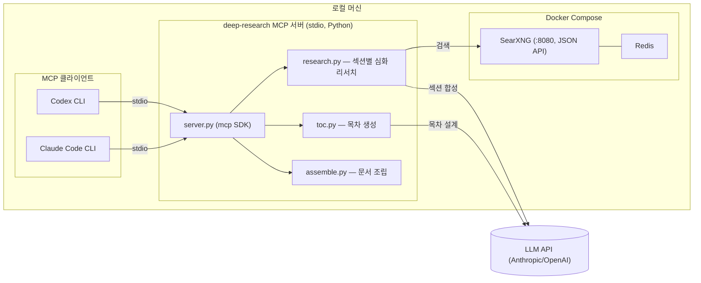

# Deep Research MCP — 설계 문서

## 1. 목적 (Why)

이 프로젝트는 범용 웹 리서치 도구가 아니라 **학습용 문서 생성기**다.

- 사용자가 과목/주제를 던지면 → **목차(TOC)를 먼저 뽑고** → **목차의 각 섹션을 독립적으로 심화 리서치**해서 → 섹션들을 모은 **학습 문서**를 만든다.
- 벤치마크는 ChatGPT/Gemini의 "Deep Research" 기능이다. 그 기능들은 질문 하나에 리포트 하나(단일 선형 리포트)를 내주는 방식인데, 이 프로젝트는 **목차 기반으로 섹션마다 독립된 리서치 예산(검색+합성)을 쓰기 때문에 섹션당 깊이와 구조적 완결성에서 우위**를 노린다.
- 이후 단계(이번 범위 아님, 출력 구조만 대비): 완성된 학습 문서를 기반으로 오디오 오버뷰(팟캐스트 스타일 요약) 생성. 그래서 출력은 처음부터 **섹션 단위 파일**로 저장해 나중에 오디오 파이프라인이 그대로 소비할 수 있게 한다.

## 2. 비목표 (Non-goals)

- 오디오 오버뷰 생성 자체 — 이번 범위 아님. 단, 출력 구조(섹션별 md 파일 + 메타데이터)는 이를 염두에 두고 설계.
- 원격/다중 사용자 접근, 인증, 원격 호스팅(Cloudflare 등) — 로컬 stdio MCP만 사용.
- SearXNG를 공개 인터넷에 노출하는 것 — localhost 바인딩만.
- 자체 LLM 서빙 — LLM은 Anthropic/OpenAI 등 외부 API 키를 그대로 사용.

## 3. "GPT/Gemini 딥리서치를 이긴다"의 운영적 정의

| 기준 | GPT/Gemini Deep Research | 이 프로젝트 |
|---|---|---|
| 구조 | 단일 선형 리포트 | 목차 기반, 섹션별 독립 문서 |
| 리서치 예산 | 전체 질문에 공유된 예산 | 섹션마다 별도 검색/합성 패스 |
| 반복 가능성 | 보통 1회성 | 섹션 단위로 재생성/심화 가능 |
| 출력 | 채팅 응답 (휘발성) | 로컬 파일로 영구 저장, 구조화 |
| 사용자 개입 | 결과 나온 후에만 피드백 가능 | 목차 단계에서 미리 검토/수정 후 본문 생성 가능 |

## 4. 아키텍처 개요



## 5. 리포지토리 구조 (제안)

```
researcher/
├── README.md
├── DESIGN.md
├── TASKS.md
├── docker-compose.yml
├── searxng/
│   └── settings.yml
├── mcp_server/
│   ├── __init__.py
│   ├── server.py                # MCP stdio 엔트리포인트, tool 등록
│   ├── toc.py                   # generate_toc 로직
│   ├── research.py              # research_section / GPTResearcher 래퍼
│   ├── assemble.py              # 섹션 파일 -> study_document.md 조립
│   ├── config.py                # env 로딩/검증
│   ├── schemas.py                # pydantic 입출력 스키마
│   └── storage.py                # outputs/<topic-slug>/ 파일 구조 관리, manifest.json
├── pyproject.toml
├── .env.example
├── .gitignore
├── tests/
│   ├── test_toc.py
│   ├── test_research.py
│   └── test_assemble.py
└── docs/
    └── setup.md                  # 구현 완료 후 Claude가 작성
```

## 6. 출력 파일 구조

```
outputs/
  <topic-slug>/
    manifest.json          # topic, created_at, depth, 섹션별 상태(pending/done)/타임스탬프/소스 수
    toc.md                 # 사람이 읽는 목차
    toc.json                # 구조화된 목차 (id, title, description, subsections)
    sections/
      01-<slug>.md          # 섹션별 심화 리서치 결과 + 인용 소스
      02-<slug>.md
      ...
    study_document.md       # toc.json 순서대로 섹션들을 이어붙인 최종 문서
```

`manifest.json`으로 섹션별 완료 상태를 추적해서, 전체를 재실행하지 않고 특정 섹션만 재생성할 수 있게 한다.

## 7. MCP 도구 정의

### 7.1 `generate_toc`
주제를 입력하면 목차를 생성한다 (아직 본문 리서치는 하지 않음 — 사용자가 목차를 검토/수정할 기회를 줌).

**입력**: `topic` (string, required), `depth` (`standard`|`deep`, default `standard`), `num_sections` (int, optional — 힌트)
**출력**: `toc: [{id, title, description, subsections: [{id, title, description}]}]`, `toc_path`
**부작용**: `outputs/<topic-slug>/toc.md`, `toc.json`, `manifest.json` 생성/갱신

### 7.2 `research_section`
목차의 특정 섹션 하나를 심화 리서치한다. 형제 섹션들의 제목/설명을 컨텍스트로 함께 전달해 **섹션 간 내용 중복을 피한다**.

**입력**: `topic`, `section_id` (required — toc.json 기준), `force` (bool, default false — 이미 완료된 섹션 덮어쓸지)
**출력**: `content_markdown`, `sources: [{title, url}]`, `section_path`
**부작용**: `outputs/<topic-slug>/sections/<section_id>-<slug>.md` 저장, `manifest.json` 상태 갱신

### 7.3 `build_study_document`
전체 파이프라인 오케스트레이션 진입점. TOC가 없으면 먼저 생성하고, 미완료 섹션들을 순회하며 `research_section`을 호출한 뒤, 모두 모아 `study_document.md`로 조립한다.

**입력**: `topic`, `depth`, `force_regenerate` (bool, default false — 전체 재생성), `sections_filter` (string[], optional — 특정 섹션만 대상)
**출력**: `study_document_markdown`, `study_document_path`, `manifest`
**진행 상황**: 섹션마다 MCP progress notification 전송 (예: "3/8 섹션 완료: <제목>")

### 7.4 `quick_search`
학습 중 용어 확인 등 가벼운 단발 검색용 (기존과 동일, 변경 없음).

**입력**: `query`, `num_results` (default 5)
**출력**: `results: [{title, url, snippet}]`

## 8. 설정 / 환경변수

`.env` (gitignore 처리, `.env.example`만 커밋):

```
# 기본 프로바이더: DeepSeek (비용 이유, 12장 참고)
DEEPSEEK_API_KEY=...
FAST_LLM=deepseek:deepseek-v4-flash
SMART_LLM=deepseek:deepseek-v4-flash
STRATEGIC_LLM=deepseek:deepseek-v4-pro

# 대체 프로바이더 (둘 중 하나만 있어도 통과)
# ANTHROPIC_API_KEY=...
# OPENAI_API_KEY=...

# GPT-Researcher는 검색 결과 유사도 계산에 항상 임베딩 클라이언트를 만든다.
# 자체 기본값(openai:...)을 그대로 두면 DeepSeek/Anthropic만 있는 설정에서도
# OPENAI_API_KEY가 없다고 즉시 에러가 난다 (실사용 검증 중 발견). 로컬/무료인
# huggingface 프로바이더로 고정해 별도 키 없이 동작하게 한다.
EMBEDDING=huggingface:sentence-transformers/all-MiniLM-L6-v2

RETRIEVER=searxng
SEARXNG_URL=http://localhost:8080

MCP_SERVER_NAME=deep-research
RESEARCH_OUTPUT_DIR=./outputs
```

> `deepseek:` 프로바이더 문자열이 설치된 `gpt-researcher` 버전에서 인식되지 않으면 12장의 OpenAI 호환 폴백을 사용한다.

## 9. 클라이언트 연동

### Claude Code CLI
```
claude mcp add deep-research -- python /path/to/researcher/mcp_server/server.py
```

### Codex CLI
`~/.codex/config.toml`:
```toml
[mcp_servers.deep-research]
command = "python"
args = ["/path/to/researcher/mcp_server/server.py"]
```

## 10. 리스크 / 트레이드오프

- **섹션 간 중복/일관성**: 섹션을 독립적으로 리서치하면 서로 겹치거나 용어가 어긋날 수 있음 → `research_section`에 형제 섹션 컨텍스트를 반드시 전달, 추후 필요시 "일관성 검토 패스" 추가 고려.
- **장시간 실행**: `build_study_document`는 섹션 수만큼 리서치가 누적되어 수십 분 걸릴 수 있음 → progress notification + 섹션별 중간 저장(중단돼도 완료된 섹션은 남음)으로 완화.
- **API 비용**: 섹션마다 별도 리서치 패스라 토큰 비용이 단일 리포트 방식보다 큼 → `depth`/`num_sections`로 사용자가 예산 조절, DeepSeek 전환(12장)으로 단가 자체도 낮춤.
- **SearXNG 크롤링 차단**: 일부 사이트가 차단할 수 있음 → GPT-Researcher의 재시도/폴백 로직 활용.
- **동시 실행**: 1차 구현은 단순 순차 처리, 이후 필요시 섹션 병렬화 고려.
- **검색 실패의 조용한 무시**: SearXNG가 특정 섹션에 대해 빈 결과만 반환하면 GPT-Researcher는 오류 대신 "소스를 찾지 못했다"는 문구를 담은 리포트를 정상 반환하고, 현재 `research_section`은 이를 그대로 `done`으로 저장한다 (실사용 검증 중 발견, 아직 미수정). 결과 품질이 이상하면 `manifest.json`의 `source_count`가 0인 섹션이 있는지 확인할 것 — 향후 `source_count == 0`을 에러로 취급할지 여부는 별도 결정 필요.

## 11. MCP와 LLM API 키의 관계 (자주 헷갈리는 부분)

> "MCP로 붙이면 Claude Code/Codex가 이미 쓰고 있는 LLM을 그대로 쓰는 거 아닌가?" — 아니다.

MCP는 이미 실행 중인 에이전트(Claude Code, Codex — 각자 자기 LLM 세션을 갖고 있음)와 **도구 서버** 사이의 호출 규약일 뿐이다. `build_study_document` 같은 도구를 호출하면, MCP 서버 프로세스 안에서 GPT-Researcher가 **자신만의 독립적인 다단계 LLM 호출**(검색어 계획 수립 → 소스 요약 → 섹션 본문 작성)을 수행한다. 이 호출은 클라이언트(Claude Code/Codex)의 LLM 세션을 거치지 않고 서버가 직접 LLM API를 때린다. 즉 **어떤 클라이언트로 붙이든 서버 프로세스 자체의 LLM 자격증명이 별도로 필요**하다 — MCP 프로토콜이 이 비용/키를 없애주지 않는다.

## 12. LLM 프로바이더: DeepSeek로 전환

API 키가 어차피 필요하다면, [10장](#10-리스크--트레이드오프)에서 지적한 "섹션별 독립 리서치 패스라 토큰 비용이 크다"는 리스크를 낮추기 위해 **DeepSeek**를 기본 프로바이더로 쓴다 (Anthropic/OpenAI 대비 토큰 단가가 훨씬 저렴 — 섹션 수가 많은 학습 문서 파이프라인 특성상 비용 절감 효과가 큼).

- `DEEPSEEK_API_KEY` 필요 (DeepSeek 콘솔에서 발급).
- GPT-Researcher는 `FAST_LLM`/`SMART_LLM`/`STRATEGIC_LLM`을 `provider:model` 형식 문자열로 받는다 (예: `deepseek:deepseek-v4-flash`). LiteLLM 직접 호출 규약은 `provider/model`(슬래시)이라 헷갈리기 쉬우니 주의 — 설치된 `gpt-researcher` 버전이 실제로 `deepseek` 프로바이더 문자열을 인식하는지 **반드시 코드/문서로 검증**할 것.
- **폴백**: 만약 설치된 버전이 `deepseek:` 프로바이더를 지원하지 않으면, DeepSeek가 제공하는 OpenAI 호환 엔드포인트(`https://api.deepseek.com`)를 `openai` 프로바이더 + 커스텀 base URL(`OPENAI_API_BASE`/`OPENAI_BASE_URL`, GPT-Researcher/langchain-openai가 인식하는 이름으로) 조합으로 우회한다.
- `STRATEGIC_LLM`(목차 설계처럼 계획 품질이 중요한 단계)은 `deepseek-v4-pro`, `FAST_LLM`/`SMART_LLM`(섹션 요약·작성)은 `deepseek-v4-flash`를 사용한다. 두 모델 모두 2026-07-26 실제 API 호출로 검증했다.
- 품질 트레이드오프: DeepSeek는 Claude/GPT 대비 저렴하지만 계획 수립(TOC 설계) 품질이 다를 수 있음 — 실사용 검증(11장 하단 체크리스트) 단계에서 목차 품질을 특별히 확인해야 한다.
- Anthropic/OpenAI 키도 계속 대체 옵션으로 지원한다 (`config.py`가 `ANTHROPIC_API_KEY`/`OPENAI_API_KEY`/`DEEPSEEK_API_KEY` 중 하나만 있어도 통과하도록).

## 13. 향후 검토 예정 (Claude가 담당, codex 범위 아님)

- 구현 완료 후 코드 리뷰 (`/code-review`).
- `docs/setup.md` 사용법 문서 작성.
- 실사용 검증: 실제 과목/주제로 `build_study_document` 끝까지 돌려서 결과물 품질 확인.
- (향후, 별도 설계) 오디오 오버뷰 파이프라인.

## 14. 원격 접속 옵션 (Cloudflare Quick Tunnel, 선택 기능)

**목적**: Claude Code/Codex CLI뿐 아니라 claude.ai 웹의 커스텀 커넥터에서도 이 MCP 서버를 쓸 수 있게, 선택적으로 네트워크에 노출한다. **로컬 stdio 모드가 여전히 기본값**이며, 이 옵션은 명시적으로 켰을 때만 동작한다 — 새로운 기본 동작이 아니다.

### 14.1 왜 Cloudflare "배포"가 아니라 "터널"인가

- 정식 Cloudflare 배포(Workers/Containers)는 인프라 재구성이 필요하다: Workers는 gpt-researcher가 쓰는 torch/sentence-transformers 같은 무거운 네이티브 의존성을 못 돌리고, Containers는 별도 이미지 빌드·운영이 필요하다.
- Quick Tunnel은 기존 로컬 프로세스를 그대로 둔 채 `cloudflared`가 로컬 포트 ↔ 공개 URL을 중계만 한다 — 인프라 재구성 없이 "웹에서도 붙는다"는 목표를 가장 적은 작업으로 달성한다.
- 트레이드오프: URL이 임시적(재시작마다 바뀜)이고, 로컬 머신이 켜져 있어야만 접속 가능하다 — 이는 로컬 우선 설계와 일관된다 (비목표: 상시 가동되는 서비스가 아니다).

### 14.2 Transport 전환

- 설치된 `mcp` SDK(FastMCP)가 `FastMCP.run(transport=...)`로 `stdio`/`sse`/`streamable-http`를 지원함을 직접 확인했다.
- 기본값은 그대로 `stdio` 유지 — 지금처럼 Claude Code `.mcp.json`/Codex `config.toml`은 아무 변경 없이 동작한다.
- 새 환경변수 `MCP_TRANSPORT`(기본 `stdio`, 원격 모드에서는 `streamable-http`)로 선택한다.
- `MCP_HOST`(기본 `127.0.0.1`), `MCP_PORT`(기본 `8765`) — **항상 로컬호스트에만 바인딩**한다. 공개 노출은 `cloudflared`가 전담하고, 서버 자체를 LAN에도 열지 않는다.

### 14.3 인증 (필수, 선택 아님)

- `streamable-http` 모드가 켜지면 `MCP_BEARER_TOKEN`이 반드시 설정돼 있어야 하며, 없으면 서버가 기동을 거부한다 (`config.py` 검증에 추가).
- FastMCP의 `TokenVerifier` 프로토콜(`async def verify_token(self, token: str) -> AccessToken | None`)을 구현해 `Authorization: Bearer <MCP_BEARER_TOKEN>` 헤더를 `secrets.compare_digest`로 상수 시간 비교 검증한다. 전체 OAuth(`AuthSettings`, `issuer_url` 등 필수 필드가 있는 무거운 스펙)는 이번 범위에서 제외 — 정적 토큰 검증만으로 충분하다.
- 토큰은 `.env`의 `MCP_BEARER_TOKEN=`에 저장한다 (`python -c "import secrets; print(secrets.token_urlsafe(32))"`로 생성 권장).
- **알려진 함정 (구현 전에 미리 확인함)**: FastMCP는 `host`가 `127.0.0.1`/`localhost`일 때 DNS 리바인딩 방지용 `TransportSecuritySettings`를 자동으로 켜고 `allowed_hosts`를 `127.0.0.1:*`/`localhost:*`로 제한한다. Quick Tunnel을 통해 들어오는 요청은 `Host` 헤더가 `*.trycloudflare.com`이라 이 기본 allowlist에서 거부된다. `streamable-http` 모드에서는 `transport_security=TransportSecuritySettings(enable_dns_rebinding_protection=False)`로 명시적으로 완화하고, 위 bearer 토큰이 실질적인 접근 통제 수단임을 문서에 명확히 밝힌다.

### 14.4 Cloudflare Quick Tunnel 실행

- 별도 설치: `cloudflared` (Cloudflare 계정/도메인 불필요 — quick tunnel은 익명 사용 가능).
- 실행: `cloudflared tunnel --url http://127.0.0.1:$MCP_PORT` → 콘솔에 `https://<random>.trycloudflare.com` 출력.
- 이 URL은 프로세스를 재시작하면 바뀐다 — 문서에 "터널을 계속 켜두거나, 바뀔 때마다 클라이언트 설정을 갱신해야 함"을 명시한다.
- Docker Compose에 넣지 않는다: SearXNG/Redis와 달리 상시 인프라가 아니라 필요할 때만 켜는 선택 프로세스이므로 별도 실행 스크립트(`scripts/tunnel.sh`)로 분리한다.

### 14.5 클라이언트 연동

- **Claude Code CLI**: `claude mcp add --transport http <name> <tunnel-url>/mcp --header "Authorization: Bearer $MCP_BEARER_TOKEN"` 형태로 등록한다. 정확한 플래그는 `claude mcp add --help`로 구현 시점에 재확인할 것 (버전에 따라 문법이 바뀔 수 있음, 이 설계 문서 작성 시점엔 미검증).
- **claude.ai 웹 (커스텀 커넥터)**: 설정 화면에서 원격 MCP 서버 URL과 인증 헤더/토큰을 등록한다. UI가 OAuth를 강제하는지는 실제 화면에서 확인이 필요하다 — 강제한다면 이번 범위(정적 토큰)로는 부족하므로 별도 후속 작업으로 분리한다.
- **Codex CLI**: 현재 `~/.codex/config.toml`의 `[mcp_servers.X]`가 `command`/`args`(로컬 프로세스 실행) 방식만 지원하는지, URL 기반 원격 transport도 지원하는지 **미확인 상태**다. 구현 시점에 검증해서 결과를 기록할 것 — 이번 설계가 보장하는 대상은 "Claude Code CLI + claude.ai 웹"이고, Codex CLI 원격 연동은 확인 후 별도 문서화한다.

### 14.6 리스크

- 로컬 프로세스가 실행 중이어야만 원격 접속 가능 (상시 서비스 아님) — 의도된 제약.
- 토큰 유출 시 DeepSeek API 예산 소비 + 로컬 SearXNG 오남용 가능 — `.env`와 동일한 수준으로 취급하고 커밋 금지 (`.gitignore`에 이미 `.env` 포함).
- Quick Tunnel은 Cloudflare의 무료/베스트에포트 서비스라 SLA가 없다 — 안정적 상시 접속이 필요해지면 이 설계가 아니라 named tunnel + 정식 배포(1번 질문에서 검토한 Cloudflare Containers 경로)로 넘어가야 한다.

### 14.7 비목표 (유지)

- Cloudflare Workers/Containers로의 정식 배포는 이번 범위 아님.
- 여러 사용자가 각자 다른 토큰으로 접근하는 다중 사용자 시나리오는 다루지 않음 (단일 공유 토큰, 1인 사용 전제).
