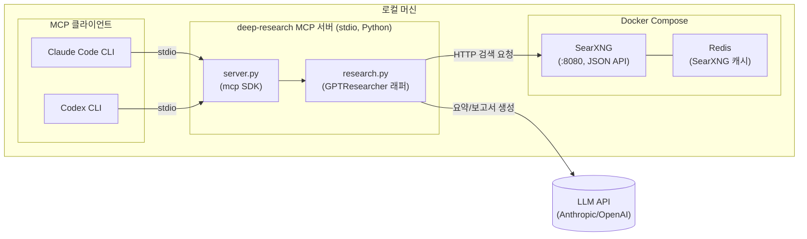

# Deep Research MCP — 설계 문서

## 1. 목표

- [GPT-Researcher](https://github.com/assafelovic/gpt-researcher)(리서치 오케스트레이션)와 [SearXNG](https://github.com/searxng/searxng)(셀프호스팅 메타서치)를 결합해 "딥 리서치" 기능을 제공하는 MCP 서버를 만든다.
- 전부 **로컬**에서 구동한다. Cloudflare 등 외부 배포는 사용하지 않는다 (성능/지연 이점이 크지 않고, 개인 로컬 사용에는 stdio 로컬 MCP가 더 단순함).
- Claude Code CLI, Codex CLI 양쪽에서 MCP 클라이언트로 연동해서 쓸 수 있어야 한다.

## 2. 비목표 (Non-goals)

- 원격/다중 사용자 접근, 인증, 원격 호스팅(Cloudflare Workers/Containers 등) — 하지 않음.
- SearXNG를 공개 인터넷에 노출하는 것 — 하지 않음 (localhost 바인딩만).
- 자체 LLM 서빙 — LLM은 Anthropic/OpenAI 등 외부 API 키를 그대로 사용 (GPT-Researcher 표준 방식).

## 3. 아키텍처 개요



- **SearXNG + Redis**: `docker-compose.yml`로 기동. `localhost:8080`에만 바인딩, JSON 응답 포맷 활성화.
- **MCP 서버**: 호스트에서 직접 실행되는 Python 프로세스 (stdio transport). Docker화하지 않는 이유는 Claude Code/Codex가 stdin/stdout으로 직접 프로세스를 실행·통신해야 하기 때문 (컨테이너로 감싸면 `docker exec -i` 브리지가 필요해 불필요하게 복잡해짐).
- **GPT-Researcher**: pip 라이브러리로 사용. `RETRIEVER=searxng`, `SEARXNG_URL=http://localhost:8080`로 설정해 자체 크롤링 대신 로컬 SearXNG를 검색 백엔드로 사용.
- **LLM**: GPT-Researcher의 `SMART_LLM`/`FAST_LLM`/`STRATEGIC_LLM` 설정을 통해 Anthropic 또는 OpenAI 모델을 지정 (사용자 보유 API 키 사용).

## 4. 리포지토리 구조 (제안)

```
researcher/
├── README.md
├── DESIGN.md
├── TASKS.md
├── docker-compose.yml
├── searxng/
│   └── settings.yml            # JSON 포맷 활성화 등 최소 설정
├── mcp_server/
│   ├── __init__.py
│   ├── server.py                # MCP 서버 엔트리포인트 (stdio)
│   ├── research.py              # GPTResearcher 오케스트레이션
│   ├── config.py                # env 로딩 / 검증
│   └── schemas.py               # MCP tool 입출력 스키마 (pydantic)
├── pyproject.toml               # 의존성: mcp, gpt-researcher, python-dotenv 등
├── .env.example
├── .gitignore
├── tests/
│   └── test_research.py         # 최소 스모크 테스트 (SearXNG mock 등)
└── docs/
    └── setup.md                 # 설치/사용법 (구현 완료 후 별도 작성)
```

## 5. MCP 도구(Tool) 정의

### 5.1 `deep_research`
멀티스텝 리서치 → 보고서 생성 (수 분 소요 가능).

**입력**
| 필드 | 타입 | 설명 |
|---|---|---|
| `query` | string (required) | 리서치 주제/질문 |
| `report_type` | enum: `research_report` \| `detailed_report` \| `resource_report` | 기본값 `research_report` |
| `max_sources` | int, default 10 | 인용할 최대 소스 수 |
| `focus_domains` | string[] (optional) | 특정 도메인으로 검색 제한 |

**출력**
| 필드 | 설명 |
|---|---|
| `report_markdown` | 생성된 리서치 보고서 (Markdown) |
| `sources` | `[{title, url}]` 인용 소스 목록 |
| `report_path` | 로컬에 저장된 보고서 파일 경로 (`outputs/`) |

**진행 상황 보고**: 리서치가 길게 걸리므로 MCP `notifications/progress`를 통해 단계별 진행(검색 중 / 소스 수집 / 초안 작성 / 최종화) 알림을 보낸다. 클라이언트(Claude Code/Codex)가 progress를 지원하지 않아도 최종 결과는 정상 반환되어야 한다.

### 5.2 `quick_search`
가벼운 단발성 검색 — SearXNG를 직접 호출해 상위 N개 결과만 반환 (리포트 생성 없음, 수 초 내 응답).

**입력**: `query` (string), `num_results` (int, default 5)
**출력**: `results: [{title, url, snippet}]`

## 6. 설정 / 환경변수

`.env` (gitignore 처리, `.env.example`만 커밋):

```
# LLM
ANTHROPIC_API_KEY=...
# 또는 OPENAI_API_KEY=...
FAST_LLM=anthropic:claude-haiku-4-5-20251001
SMART_LLM=anthropic:claude-sonnet-5
STRATEGIC_LLM=anthropic:claude-sonnet-5

# Retriever
RETRIEVER=searxng
SEARXNG_URL=http://localhost:8080

# MCP 서버
MCP_SERVER_NAME=deep-research
RESEARCH_OUTPUT_DIR=./outputs
```

## 7. 클라이언트 연동

### Claude Code CLI
```
claude mcp add deep-research -- python /path/to/researcher/mcp_server/server.py
```
또는 프로젝트 `.mcp.json`에 등록.

### Codex CLI
`~/.codex/config.toml`:
```toml
[mcp_servers.deep-research]
command = "python"
args = ["/path/to/researcher/mcp_server/server.py"]
```

## 8. 리스크 / 트레이드오프

- **장시간 실행 도구 호출**: `deep_research`가 수 분 걸릴 수 있어 클라이언트 타임아웃 설정 확인 필요. progress notification으로 완화.
- **SearXNG 크롤링 차단**: 일부 사이트가 SearXNG User-Agent/요청을 차단할 수 있음 → GPT-Researcher의 재시도/폴백 로직 확인 필요.
- **API 비용**: LLM 호출 비용은 사용자 부담 (다단계 리서치는 토큰 소모가 큼) — `max_sources`/`report_type`으로 조절 가능하게 노출.
- **동시 실행**: 로컬 단일 프로세스이므로 동시에 여러 `deep_research` 호출 시 큐잉/직렬화 정책 필요 (1차 구현은 단순 동시 실행 허용, 이후 필요시 세마포어 추가).

## 9. 향후 검토 예정 (Claude가 담당)

- 구현 완료 후 코드 리뷰 (`/code-review`).
- `docs/setup.md` 사용법 문서 작성.
- 실사용 테스트 (Claude Code / Codex 양쪽에서 실제 tool call 검증).
