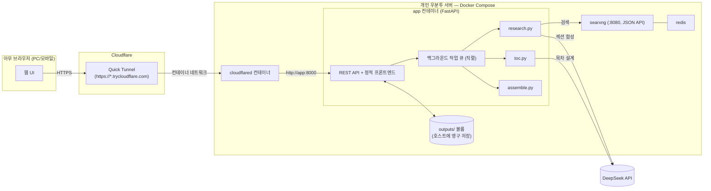

# Deep Research 개인 웹 앱 — 설계 문서

> **2026-07-26 전환**: 이 프로젝트는 원래 Claude Code/Codex용 MCP 서버로 설계됐다 (과거 버전은 git 히스토리 참고). 실사용해보니 핵심 워크플로우(`generate_toc` → `research_section` → `assemble`)가 에이전트의 판단이 필요 없는 **결정론적 배치 파이프라인**이라, MCP로 감쌀 이유가 약했다. 그래서 MCP를 걷어내고, 개인 우분투 서버에 Docker Compose로 띄워 Cloudflare Quick Tunnel로 접속하는 **개인용 웹 앱**으로 재설계한다. §15에 정확히 뭐가 없어지는지 정리해뒀다.

## 1. 목적 (Why)

여전히 범용 웹 리서치 도구가 아니라 **학습용 문서 생성기**다.

- 사용자가 과목/주제를 던지면 → **목차(TOC)를 먼저 뽑고** → **목차의 각 섹션을 독립적으로 심화 리서치**해서 → 섹션들을 모은 **학습 문서**를 만든다.
- 벤치마크는 ChatGPT/Gemini의 "Deep Research" 기능이다 (운영적 정의는 §3, 변경 없음).
- 이후 단계(이번 범위 아님): 오디오 오버뷰. 출력은 섹션 단위 파일로 유지해 대비한다.
- **새로 추가되는 목적**: 개인 서버에 상시 띄워두고, 휴대폰을 포함한 아무 브라우저에서나 Cloudflare Quick Tunnel URL로 접속해 주제를 넣고 결과를 확인·다운로드·삭제할 수 있어야 한다. 완전히 1인 전용이다.

## 2. 비목표 (Non-goals)

- 오디오 오버뷰 생성 자체.
- **MCP/에이전트 프로토콜** — Claude Code, Codex, claude.ai 커넥터 연동 전부 제거. 이 앱은 브라우저로 직접 쓴다.
- 다중 사용자, 회원가입/역할 기반 권한 — 단일 공유 비밀번호(§12)로 충분하다.
- Cloudflare 정식 배포(Workers/Containers) — 이전에 검토했지만(과거 §14 참고, git 히스토리), Quick Tunnel로 충분하다는 결론은 유지.
- SearXNG를 공개 인터넷에 직접 노출하는 것 — 여전히 컨테이너 내부 네트워크에만 존재.

## 3. "GPT/Gemini 딥리서치를 이긴다"의 운영적 정의 (변경 없음)

| 기준 | GPT/Gemini Deep Research | 이 프로젝트 |
|---|---|---|
| 구조 | 단일 선형 리포트 | 목차 기반, 섹션별 독립 문서 |
| 리서치 예산 | 전체 질문에 공유된 예산 | 섹션마다 별도 검색/합성 패스 |
| 반복 가능성 | 보통 1회성 | 섹션 단위로 재생성/심화 가능 |
| 출력 | 채팅 응답 (휘발성) | 서버에 영구 저장, 다운로드 가능 |
| 사용자 개입 | 결과 나온 후에만 피드백 가능 | 목차 단계에서 미리 검토 후 본문 생성 여부 결정 |

## 4. 아키텍처 개요



핵심 변화: MCP 클라이언트(Claude Code/Codex) 자리를 **웹 UI**가 대체하고, MCP stdio/streamable-http transport 자리를 **FastAPI REST API**가 대체한다. `toc.py`/`research.py`/`assemble.py`/`storage.py`/`config.py`의 도메인 로직은 프레임워크에 종속되지 않게 짜여 있어서 거의 그대로 재사용한다.

## 5. 리포지토리 구조

```
researcher/
├── README.md
├── DESIGN.md
├── TASKS.md
├── docker-compose.yml            # redis, searxng, app, cloudflared 네 개 서비스
├── Dockerfile                    # app 이미지
├── searxng/
│   └── settings.yml
├── app/                           # (구 mcp_server/ 를 이 이름으로 변경)
│   ├── __init__.py
│   ├── main.py                    # FastAPI 앱, 라우트, 백그라운드 작업, basic auth
│   ├── toc.py                     # 그대로 재사용
│   ├── research.py                # 그대로 재사용
│   ├── assemble.py                # 그대로 재사용
│   ├── config.py                  # env 로딩/검증 (MCP 관련 필드 제거, SITE_PASSWORD 추가)
│   ├── schemas.py                 # pydantic 모델 — FastAPI 요청/응답 스키마로 재사용
│   ├── storage.py                 # 그대로 재사용
│   ├── jobs.py                    # 신규: 직렬 백그라운드 작업 큐
│   └── static/                    # 신규: 프론트엔드 (빌드 툴체인 없는 순수 HTML/CSS/JS)
│       ├── index.html
│       ├── app.js
│       └── style.css
├── pyproject.toml                 # mcp 의존성 제거, fastapi/uvicorn 추가
├── .env.example
├── .gitignore
├── tests/
│   ├── test_toc.py
│   ├── test_research.py
│   ├── test_assemble.py
│   ├── test_storage.py
│   └── test_api.py                # 신규: FastAPI 엔드포인트 테스트 (httpx AsyncClient)
├── scripts/
│   ├── up.sh                      # docker compose up -d + 헬스체크 + 터널 URL 출력
│   ├── down.sh                    # docker compose down
│   └── get-tunnel-url.sh          # cloudflared 컨테이너 로그에서 현재 URL 추출
└── docs/
    └── setup.md
```

제거 대상은 §15에 정리.

## 6. 출력 파일 구조 (변경 없음)

```
outputs/
  <topic-slug>/
    manifest.json          # topic, created_at, depth, 섹션별 상태(pending/in_progress/done/error)/타임스탬프/소스 수
    toc.md
    toc.json
    sections/
      01-<slug>.md
      02-<slug>.md
      ...
    study_document.md
```

Docker Compose에서 `outputs/`를 호스트 디렉터리에 바인드 마운트해 컨테이너를 내렸다 올려도 데이터가 남게 한다 (§11).

## 7. REST API

인증은 모든 엔드포인트에 공통 적용 (§12). 아래는 라우트별 계약만 기술.

| 메서드 | 경로 | 설명 |
|---|---|---|
| `POST` | `/api/topics` | `{topic, depth, num_sections?}` → `generate_toc()` 실행 후 TOC 반환. **본문 리서치는 시작하지 않음** — 이 응답을 UI가 보여주고, 사용자가 다음 행동을 고른다. |
| `GET` | `/api/topics` | 저장된 모든 주제 목록 (topic, slug, depth, 생성일, 완료 섹션 수/전체 섹션 수, study_document 존재 여부) — `outputs/` 스캔 + manifest 요약. |
| `GET` | `/api/topics/{slug}` | TOC + manifest(섹션별 상태) 상세. UI가 폴링해서 진행 상황을 갱신하는 데 씀. |
| `POST` | `/api/topics/{slug}/sections/{section_id}/research` | 섹션 하나 리서치 시작 (`research_section`, 작업 큐에 등록, 즉시 202 반환). |
| `POST` | `/api/topics/{slug}/build` | 미완료 섹션 전체 리서치 + 조립 (`build_study_document`, 작업 큐 등록, 즉시 202 반환). `sections_filter`, `force_regenerate` 지원. |
| `GET` | `/api/topics/{slug}/document` | 조립된 `study_document.md` 본문 (브라우저에서 바로 렌더링용). |
| `GET` | `/api/topics/{slug}/download` | `study_document.md`를 첨부파일로 다운로드. |
| `DELETE` | `/api/topics/{slug}` | 해당 주제의 `outputs/<slug>/` 디렉터리 전체 삭제. |

작업 상태는 별도 DB 없이 기존 `manifest.json`의 섹션별 `status`를 그대로 진행 상황 소스로 쓴다 — 이미 있는 걸 재사용하는 게 새 상태 저장소를 만드는 것보다 낫다.

## 8. 백그라운드 작업 모델

- **직렬 처리, 큐 하나**: 리서치 요청(`research_section`/`build_study_document`)은 프로세스 내 `asyncio` 작업 큐에 순서대로 쌓이고 한 번에 하나씩만 실행한다. 1인 사용이라 동시성이 필요 없고, `research.py`의 `_configure_gpt_researcher()`가 `os.environ`을 프로세스 전역으로 덮어쓰는 방식이라 **진짜 병렬 실행은 경쟁 상태(race condition)를 만든다** — 직렬화가 정답이자 이미 검증된(§10 과거 `RETRIEVER` 충돌 버그 참고) 안전한 선택이다.
- **진행 상황 전달은 폴링**: SSE/WebSocket 대신, UI가 `GET /api/topics/{slug}`를 몇 초 간격으로 폴링해서 `manifest.json`의 섹션 상태 변화를 반영한다. Cloudflare Quick Tunnel + 모바일 네트워크 전환(와이파이↔셀룰러) 환경에서 SSE/WebSocket보다 폴링이 훨씬 덜 끊긴다 — 새로고침 한 번이면 복구되는 단순함이 안정성 이점이 큼.
- 서버 재시작 시 `in_progress` 상태로 멈춰있는 섹션은 재시작 후 큐에 자동으로 다시 넣지 않는다 (1차 구현 범위 아님) — 사용자가 UI에서 해당 섹션을 다시 트리거하면 됨.

## 9. 웹 UI

빌드 툴체인 없는 순수 HTML/CSS/바닐라 JS (`fetch` API로 위 REST 호출). Node/webpack 없이 `app` 이미지에 정적 파일로 포함 — 배포를 단순하게 유지하기 위한 의도적 선택.

- **홈 (주제 목록)**: 저장된 주제 카드 목록 (제목, 진행률 N/M, 생성일). 각 카드에 "열기" / "다운로드"(완료된 경우) / "삭제" 버튼. 상단에 "새 주제" 입력창.
- **새 주제 생성**: 주제 텍스트 + `depth`(standard/deep) 입력 → 제출 → `POST /api/topics` → 목차 화면으로 이동.
- **목차 화면**: 생성된 목차(섹션+하위섹션)를 보여주고, 사용자가 여기서 결정한다 — "**전체 리서치 시작**"(빠른 경로, `build_study_document`) 버튼과, 섹션마다 개별 "**이 섹션만 리서치**" 버튼을 둘 다 노출. 이게 "목차를 뽑을지 안 뽑을지"를 UI 단계로 만든 부분 — 목차만 보고 끝낼 수도, 바로 전체를 돌릴 수도, 섹션별로 골라 돌릴 수도 있다.
- **진행/상세 화면**: 섹션별 상태 뱃지(pending/in_progress/done/error) + 소스 개수, 몇 초 간격 폴링으로 갱신. "전체 문서 보기", "다운로드", "삭제" 버튼.
- **모바일 대응**: 반응형 CSS(flexbox + 미디어 쿼리)만으로 충분 — 페이지 수가 적고 표/카드 위주라 별도 프레임워크 불필요.

## 10. 리스크 / 트레이드오프

- **섹션 간 중복/일관성**: 기존과 동일, `research_section`에 형제 섹션 컨텍스트 전달로 완화 (변경 없음).
- **장시간 실행**: 이제 브라우저 탭을 닫아도 서버가 계속 진행한다는 게 stdio/streamable-http 시절보다 오히려 나음 — 폴링으로 다시 열어서 확인하면 됨.
- **API 비용**: 기존과 동일, DeepSeek 전환(§14)으로 단가 낮춤.
- **SearXNG 크롤링 차단**: 기존과 동일.
- **동시 실행**: §8에서 결정한 대로 의도적으로 직렬화.
- **검색 실패의 조용한 무시**: 기존 이슈 그대로 유지 (미수정, `manifest.json`의 `source_count`로 확인 가능).
- **Quick Tunnel 인증**: URL 자체는 인증이 아니다 (§12).
- **서버 다운타임 중 작업 손실**: `in_progress` 상태에서 컨테이너가 죽으면 해당 섹션은 재시작 후에도 `in_progress`로 남아 자동 재시도되지 않는다 — 사용자가 수동으로 다시 트리거해야 함 (1인 사용 규모에서는 허용 가능한 트레이드오프로 판단).

## 11. 배포 (Ubuntu + Docker Compose)

### 11.1 서비스 구성 (`docker-compose.yml`)

- `redis`, `searxng` — 기존과 동일, `127.0.0.1:8080`에만 바인딩 (호스트에도 외부 노출 안 함, `app`이 컨테이너 네트워크로만 접근).
- `app` — 신규. `Dockerfile`로 빌드, `outputs/`를 호스트 디렉터리에 바인드 마운트, 내부 포트 8000. **호스트에 포트 노출하지 않는다** (`ports:` 없음) — `cloudflared`만 `app`에 접근하면 되므로 컨테이너 네트워크 안에서만 통신.
- `cloudflared` — 신규. 공식 `cloudflare/cloudflared` 이미지, `command: tunnel --url http://app:8000`. 이것도 컴포즈 서비스로 넣어서 `docker compose up`/`down` 한 번으로 앱+터널이 통째로 뜨고 내려가게 한다 (요구사항: "자동화 체인으로 띄웠다 내리기 편했으면").

### 11.2 라이프사이클 스크립트

- `scripts/up.sh`: `docker compose up -d` → `searxng`/`app` 헬스체크 대기 → `scripts/get-tunnel-url.sh` 호출해 현재 세션의 Quick Tunnel URL을 화면에 출력.
- `scripts/down.sh`: `docker compose down`.
- `scripts/get-tunnel-url.sh`: `docker compose logs cloudflared`에서 `https://*.trycloudflare.com` 패턴을 grep해 최신 URL만 출력 (Quick Tunnel URL은 재시작마다 바뀌므로 매번 새로 조회해야 함).

### 11.3 로그

- `docker compose logs -f app` — 애플리케이션/작업 큐 로그.
- `docker compose logs -f cloudflared` — 터널 연결 상태 + URL.
- 별도 로그 수집기(예: Loki 등)는 이번 범위 아님 — `docker compose logs`로 충분한 개인 사용 규모.

## 12. 인증 / 보안

요청사항은 "DeepSeek API 키 하나만 비밀키로 가지면 좋겠다"였지만, 이 부분은 **그 원칙에 하나만 예외를 둔다**: Quick Tunnel URL은 무작위 문자열일 뿐 실제 인증이 아니라서, 아무 보호 장치 없이 그대로 열어두면 URL을 아는(또는 우연히 찾은) 누구나 당신의 DeepSeek 예산을 쓰고 개인 학습 문서를 읽고 다운로드/삭제까지 할 수 있다.

그래서 **HTTP Basic Auth 하나만 추가**한다 — `SITE_PASSWORD` 환경변수 하나로 끝나는, 별도 계정/로그인 화면/세션 관리가 필요 없는 가장 가벼운 방식이다. 브라우저(모바일 포함)가 기본 지원하는 로그인 팝업을 그대로 쓴다.

- `.env`에 `SITE_PASSWORD=<임의 비밀번호>`.
- `app/main.py`에 FastAPI `HTTPBasic` 의존성을 전체 라우터에 미들웨어로 적용, `secrets.compare_digest`로 비교.
- 이건 API 키처럼 발급받거나 회전시킬 필요가 없는, 당신이 직접 정하는 로컬 비밀번호라 "관리해야 할 비밀"이 실질적으로 늘어나는 건 아니라고 판단했다 — 다만 원치 않으면 `SITE_PASSWORD`를 비워서 끌 수 있게 만들고, 그 경우 서버 시작 시 "인증 없이 공개 노출됨" 경고를 로그에 남기는 정도로 타협한다.

## 13. 설정 / 환경변수

```
# LLM (기본: DeepSeek)
DEEPSEEK_API_KEY=...
FAST_LLM=deepseek:deepseek-v4-flash
SMART_LLM=deepseek:deepseek-v4-flash
STRATEGIC_LLM=deepseek:deepseek-v4-pro
# 대체 프로바이더 (선택)
# ANTHROPIC_API_KEY=...
# OPENAI_API_KEY=...

# 임베딩 (로컬/무료, OPENAI_API_KEY 불필요 이유는 §14 하단 참고)
EMBEDDING=huggingface:sentence-transformers/all-MiniLM-L6-v2

RETRIEVER=searxng
SEARXNG_URL=http://searxng:8080     # 컨테이너 네트워크 내부 호스트명으로 변경
SEARXNG_SECRET=replace-with-a-random-secret   # 여전히 무효 (알려진 이슈, docs 참고)

RESEARCH_OUTPUT_DIR=/data/outputs   # 컨테이너 내부 경로, 볼륨으로 마운트

# 웹 앱 전용 (신규)
SITE_PASSWORD=<임의 비밀번호>
APP_PORT=8000
```

MCP 전용 변수(`MCP_TRANSPORT`, `MCP_HOST`, `MCP_PORT`, `MCP_BEARER_TOKEN`, `MCP_SERVER_NAME`)는 전부 제거한다.

## 14. LLM 프로바이더: DeepSeek (유지, 과거 §12 내용 그대로 유효)

- `DEEPSEEK_API_KEY` 하나로 `FAST_LLM`/`SMART_LLM`/`STRATEGIC_LLM`을 `deepseek:deepseek-v4-flash`/`deepseek:deepseek-v4-pro`로 구동 (2026-07-26 실제 API 호출로 검증됨).
- GPT-Researcher의 임베딩 클라이언트가 기본적으로 OpenAI를 요구하는 문제는 `EMBEDDING=huggingface:sentence-transformers/all-MiniLM-L6-v2`(로컬, 키 불필요)로 이미 해결되어 있다 — 이 부분은 그대로 재사용, 다시 만들 필요 없음.
- `gpt-researcher`는 `pyproject.toml`에서 `>=0.14.0,<0.16.0`로 버전 상한이 고정돼 있다 (0.16.0의 import 순서 버그 회피, 이미 검증됨) — 이 핀도 그대로 유지.
- Anthropic/OpenAI는 계속 대체 옵션으로 `config.py`에 남겨둔다 (비용 거의 없음, 유연성 유지).

## 15. MCP → 웹앱 전환: 정확히 뭐가 없어지는가

codex가 헷갈리지 않도록 명시적으로 나열한다.

> **참고**: 이 전환을 설계하는 시점 직전에, 사용자가 이 대화와 별개로 `.mcp.json`/`.codex/config.toml`의 python 경로·`CLAUDE_PROJECT_DIR` 문제를 직접 고치고(`git rev-parse --show-toplevel` 기반으로 저장소 루트를 찾도록 개선), ChatGPT를 이 MCP 서버의 원격(streamable-http) 모드에 연결해보는 것까지 시도해 `docs/chatgpt-cloudflare-quick-tunnel.md`에 결과(정적 토큰만으로는 ChatGPT의 OAuth 요구사항을 못 맞춰서 완전 연동은 안 됨, 터널+토큰 자체는 curl로 정상 동작 확인됨)를 정리해뒀다. 이 전환으로 MCP 자체를 없애므로 이 최근 작업들은 전부 아래 "삭제" 대상에 포함된다 — 무의미해져서가 아니라 이 프로젝트가 더 이상 MCP 클라이언트를 대상으로 하지 않기 때문이다.

**삭제**:
- `mcp_server/server.py` (FastMCP 엔트리포인트) — `app/main.py`(FastAPI)로 대체.
- `mcp_server/auth.py` (MCP `TokenVerifier`) — `app/main.py`의 HTTP Basic Auth로 대체.
- `.mcp.json`, `.codex/config.toml`(및 `.gitignore`의 `.codex/*`/`!.codex/config.toml` 예외 규칙), README/docs의 Claude Code/Codex/ChatGPT MCP 등록 안내 전체.
- `docs/chatgpt-cloudflare-quick-tunnel.md` (원격 MCP 모드 자체가 없어지므로 이 문서가 다루는 내용도 사라짐).
- `scripts/tunnel.sh` (호스트 레벨 wrapper) — `docker-compose.yml`의 `cloudflared` 서비스로 대체.
- `pyproject.toml`의 `mcp` 의존성.
- `.env.example`의 `MCP_*` 변수 전부.
- `tests/test_auth.py`, `tests/test_server.py` (MCP 전용 테스트) — 새 `tests/test_api.py`로 대체.

**이름 변경**: `mcp_server/` → `app/` (내부 import 경로 전부 `mcp_server.` → `app.`로 갱신 필요).

**그대로 재사용** (내용 변경 없음, 디렉터리만 이동): `toc.py`, `research.py`, `assemble.py`, `storage.py`, `schemas.py`(pydantic 모델은 FastAPI 요청/응답으로 그대로 씀), `config.py`(MCP 관련 필드만 제거, `SITE_PASSWORD` 추가).

**신규**: `app/main.py`, `app/jobs.py`, `app/static/*`, `Dockerfile`, `docker-compose.yml`의 `app`/`cloudflared` 서비스, `scripts/up.sh`/`down.sh`/`get-tunnel-url.sh`, `tests/test_api.py`.

## 17. UI 개선 사항 (Phase 13 구현 대상)

> 실사용(모바일 포함) 중 발견된 4건. 설계 명세를 아래에 정리하고 Phase 13에서 구현한다.

### 17.1 [이 섹션만 리서치] 버튼 — 작업 진행 중 비활성화

**현상**: TOC 화면에서 [전체 리서치 시작]이나 [이 섹션만 리서치]를 눌러 빌드가 큐에 들어간 상태에서 TOC 화면으로 돌아오면, 아직 `pending`인 섹션의 버튼이 활성화 상태로 남아있다.

**원인**: `tocSection()`은 *해당 섹션 자체*가 `in_progress`이거나 `done`일 때만 비활성화한다. `pending` 섹션은 전체 빌드 큐에 이미 들어있더라도 매니페스트 상태가 여전히 `pending`이어서 버튼이 활성화된다. 클릭하면 중복 큐잉이 발생한다.

**수정 명세 (`app/static/app.js`)**:
- `renderToc()` 에서 manifest를 가져온 직후, `const isRunning = manifest.sections.some(s => s.status === "in_progress");` 플래그를 설정한다.
- `tocSection(section, manifest, isRunning)` 시그니처에 `isRunning` 파라미터를 추가하고, `const disabled = isRunning || state?.status === "in_progress" || state?.status === "done";` 로 변경한다.
- 섹션 자체가 `in_progress`일 때 버튼 텍스트를 `"진행 중…"` 으로 변경한다 (현재는 `"이 섹션만 리서치"` 그대로 표시됨).
- `isRunning` 이면 [전체 리서치 시작] 버튼도 비활성화한다.
- `isRunning` 이면 TOC 화면도 3초 간격 폴링을 시작해 섹션 상태 변화를 자동으로 반영한다. 화면 상단에 `"리서치가 진행 중입니다. 자동으로 갱신됩니다."` 안내 문구를 표시한다.

### 17.2 단일 섹션 리서치 결과 열람

**현상**: [이 섹션만 리서치]가 완료되어도 해당 섹션 내용을 볼 방법이 없다. 진행/상세 화면은 완성된 `study_document.md`가 있을 때만 [전체 문서 보기] / [다운로드]를 노출하는데, 단일 섹션 리서치는 `study_document.md`를 생성하지 않는다.

**의도 확인**: 완전한 문서가 완성되기 전에도 섹션 단위 결과를 볼 수 있는 것이 맞다. 전체 문서 완성 후에만 볼 수 있게 제한한 것은 의도적 설계가 아님.

**수정 명세**:
- `app/main.py` — 새 엔드포인트 추가:
  ```
  GET /api/topics/{slug}/sections/{section_id}
  ```
  `storage.section_path(section_id)`로 파일 경로를 찾아 `PlainTextResponse`로 반환 (media_type `text/markdown; charset=utf-8`). 파일이 없거나 해당 섹션이 `done` 상태가 아니면 404.
- `app/static/app.js` — `statusRow()`: `done` 상태 섹션에 [보기] 버튼 추가 (`href="#/topic/{slug}/section/{section_id}"`).
- `app/static/app.js` — `renderSectionDocument(slug, sectionId)` 함수 구현, `route()` 에 `#/topic/{slug}/section/{section_id}` 라우트 추가. 마크다운 렌더링은 §17.4와 동일한 방식 사용.

### 17.3 다운로드 파일 한국어 인코딩 깨짐

**현상**: 모바일에서 다운로드한 `.md` 파일을 열면 한국어가 깨진다.

**원인**: `download_document` 엔드포인트가 `media_type="text/markdown"` 만 지정하고 `charset`을 명시하지 않는다. 파일 자체는 UTF-8로 저장되어 있지만 Content-Type 헤더에 charset 정보가 없어서 일부 모바일 앱이 시스템 기본 인코딩으로 해석한다.

**수정 명세 (`app/main.py`)**:
- `download_document` 엔드포인트: `media_type="text/markdown; charset=utf-8"` 으로 변경.
- `get_document` 엔드포인트 (PlainTextResponse): 마찬가지로 `media_type="text/markdown; charset=utf-8"` 로 변경.
- §17.2에서 추가하는 `GET /api/topics/{slug}/sections/{section_id}` 도 동일하게 charset 명시.

### 17.4 전체 문서 마크다운 렌더링

**현상**: [전체 문서 보기] 버튼이 `/api/topics/{slug}/document`를 새 탭에서 열어 raw 마크다운 텍스트를 그대로 노출한다. `#`, `**` 등 기호가 날것으로 보여 읽기 어렵다.

**수정 명세**:
- `app/static/index.html`: `<head>` 에 marked.js CDN 스크립트 추가.
  ```html
  <script src="https://cdn.jsdelivr.net/npm/marked/marked.min.js"></script>
  ```
- `app/static/app.js`:
  - `renderDocument(slug)` 함수 구현: `GET /api/topics/{slug}/document` 로 텍스트를 fetch한 뒤 `marked.parse(text)` 로 HTML로 변환해 표시. [다운로드] 버튼과 [← 돌아가기] 링크도 함께 제공.
  - `route()` 에 `#/topic/{slug}/document` 해시 라우트 추가.
  - progress 화면의 [전체 문서 보기] 링크를 `href="/api/topics/..."` (새 탭)에서 `href="#/topic/{slug}/document"` 로 변경.
- `app/static/style.css`: `.prose` 클래스에 타이포그래피 스타일 추가 — 헤딩 크기/여백, 목록 들여쓰기, `<code>` 배경색, 링크 색상, 수평선, 충분한 행간.
- 빌드 툴체인 없는 순수 HTML/CSS/바닐라 JS 원칙(§9) 유지 — CDN 스크립트 태그 하나로 해결.
- §17.2의 `renderSectionDocument`도 동일한 `.prose` 스타일과 marked.js 렌더러 사용.

### 17.5 전체 문서 보기에서 목차 앵커 클릭 시 홈으로 튕기는 문제 (§17.4의 회귀)

**현상**: [전체 문서 보기](`#/topic/{slug}/document`)에서 렌더링된 문서 상단 "목차"의 링크(`01. 제목` 등)를 클릭하면 문서 내 해당 섹션으로 스크롤되는 대신 홈 화면(`#/`)으로 돌아간다. 실사용(모바일) 중 발견.

**원인 (재현 확인 완료)**: `app/assemble.py`가 조립하는 문서는 다음 앵커 구조를 갖는다.

```
## 목차
- [01. 제목](#section-01)
...
<a id="section-01"></a>
## 01. 제목
```

§17.4에서 `renderDocument()`가 이 마크다운을 `marked.parse()`로 HTML 변환해 그대로 렌더링하므로, 위 목차 링크는 실제 `<a href="#section-01">`로 존재한다. 그런데 앱 전체가 `window.location.hash` 기반 SPA 라우터(`window.addEventListener("hashchange", route)`)를 쓰고 있어서, 이 링크를 클릭해 브라우저가 `location.hash`를 `#section-01`로 바꾸는 순간 `hashchange`가 발생하고 `route()`가 끼어든다. `route()`의 파싱(`hash.replace(/^#\/?/, "").split("/").filter(Boolean)`)은 `"#section-01"` → `["section-01"]`이 되는데, 이는 `parts[0] === "new"`도 `"topic"`도 아니므로 마지막 `else { window.location.hash = "#/"; }`에 걸려 **홈으로 강제 이동**한다 — 브라우저 네이티브 "같은 페이지 내 앵커로 스크롤" 동작이 라우터에 가로채여 실행되지 못하는 것이다. (`node -e`로 파싱 결과 직접 확인함.) `assemble.py`나 백엔드 쪽 문제가 아니라 순수 프론트엔드(`app.js`) 문제다.

**수정 명세 (`app/static/app.js`만 변경, 백엔드/`assemble.py` 변경 없음)**:
- 새 헬퍼 함수 추가:
  ```js
  function enableInPageAnchors(container) {
    container.addEventListener("click", (event) => {
      const link = event.target.closest('a[href^="#"]');
      if (!link) return;
      const targetId = link.getAttribute("href").slice(1);
      const target = document.getElementById(targetId);
      if (target) {
        event.preventDefault();
        target.scrollIntoView({ behavior: "smooth", block: "start" });
      }
      // target이 없으면(=앱 라우트로 의도된 링크) 그대로 두어 기존
      // hashchange → route() 흐름을 타게 한다.
    });
  }
  ```
- `renderDocument(slug)`에서 `.prose` 엘리먼트를 렌더링한 직후 `enableInPageAnchors(appRoot.querySelector(".prose"))` 호출.
- `renderSectionDocument(slug, sectionId)`에도 동일하게 호출 (현재 섹션 파일엔 내부 앵커가 없어 지금 당장 버그는 없지만, 마크다운 렌더링 경로를 §17.4와 공유하므로 방어적으로 동일 처리).
- 이벤트 위임(container에 리스너 하나) 방식이라 `marked.parse()`가 만들어내는 링크 개수와 무관하게 동작한다. `document.getElementById`로 대상이 실제로 존재할 때만 `preventDefault()` + `scrollIntoView()`하고, 없으면 기존 라우터 흐름을 그대로 타게 둬서 다른 정상 라우트 링크(`← 돌아가기` 등, 이미 앱 라우트 경로라 `href`가 `#/topic/...`형태이며 `getElementById`가 못 찾음)에는 영향이 없다.
- `window.location.hash` 자체를 바꾸지 않으므로 `hashchange`/`route()`가 아예 발동하지 않는다 — 뒤로가기 버튼 동작에도 영향 없음 (히스토리 엔트리를 추가/변경하지 않음).

**회귀 테스트 없음(JS 유닛 테스트 인프라가 없음)** — 실사용 검증(§16)에서 실제 브라우저로 목차 앵커 클릭 시 스크롤되는지, 그리고 다른 앱 라우트 링크(홈으로, 목차와 작업 선택 등)는 여전히 정상 동작하는지 확인 필요.

---

## 16. 향후 검토 예정 (Claude가 담당, codex 범위 아님)

- 구현 완료 후 코드 리뷰.
- 실사용 검증: 실제 우분투 서버(또는 동등 환경)에 `docker compose up`으로 띄우고, Quick Tunnel URL로 모바일 브라우저에서 접속해 주제 생성 → 목차 검토 → 섹션 리서치 → 다운로드 → 삭제까지 전 과정 확인.
- `docs/setup.md`를 웹앱 배포/사용법 기준으로 재작성.
- (향후, 별도 설계) 오디오 오버뷰 파이프라인.
