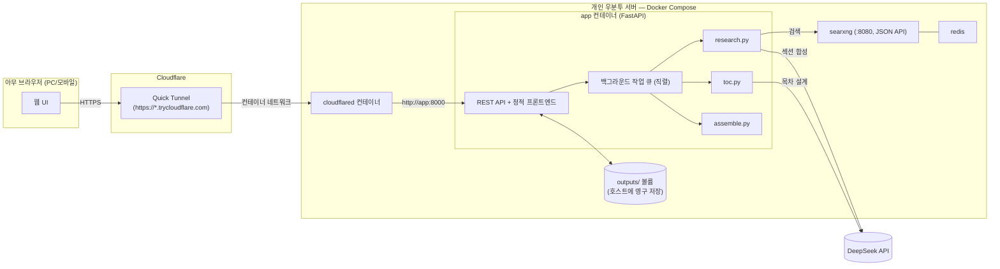

# Deep Research 개인 웹 앱 — 설계 문서

> **2026-07-26 전환**: 이 프로젝트는 원래 Claude Code/Codex용 MCP 서버로 설계됐다 (과거 버전은 git 히스토리 참고). 실사용해보니 핵심 워크플로우(`generate_toc` → `research_section` → `assemble`)가 에이전트의 판단이 필요 없는 **결정론적 배치 파이프라인**이라, MCP로 감쌀 이유가 약했다. 그래서 MCP를 걷어내고, 개인 우분투 서버에 Docker Compose로 띄워 Cloudflare Quick Tunnel로 접속하는 **개인용 웹 앱**으로 재설계한다. §15에 정확히 뭐가 없어지는지 정리해뒀다.

## 1. 목적 (Why)

여전히 범용 웹 리서치 도구가 아니라 **학습용 문서 생성기**다.

- 사용자가 과목/주제를 던지면 → **목차(TOC)를 먼저 뽑고** → **목차의 각 섹션을 독립적으로 심화 리서치**해서 → 섹션들을 모은 **학습 문서**를 만든다.
- 벤치마크는 ChatGPT/Gemini의 "Deep Research" 기능이다 (운영적 정의는 §3, 변경 없음).
- 이후 단계(이번 범위 아님): 오디오 오버뷰. 출력은 섹션 단위 파일로 유지해 대비한다.
- **새로 추가되는 목적**: 개인 서버에 상시 띄워두고, 휴대폰을 포함한 아무 브라우저에서나 Cloudflare Quick Tunnel URL로 접속해 주제를 넣고 결과를 확인·다운로드·삭제할 수 있어야 한다. 완전히 1인 전용이다.

## 2. 비목표 (Non-goals)

- 오디오 오버뷰 생성 자체.
- **MCP/에이전트 프로토콜** — Claude Code, Codex, claude.ai 커넥터 연동 전부 제거. 이 앱은 브라우저로 직접 쓴다.
- 다중 사용자, 회원가입/역할 기반 권한 — 단일 공유 비밀번호(§12)로 충분하다.
- Cloudflare 정식 배포(Workers/Containers) — 이전에 검토했지만(과거 §14 참고, git 히스토리), Quick Tunnel로 충분하다는 결론은 유지.
- SearXNG를 공개 인터넷에 직접 노출하는 것 — 여전히 컨테이너 내부 네트워크에만 존재.

## 3. "GPT/Gemini 딥리서치를 이긴다"의 운영적 정의 (변경 없음)

| 기준 | GPT/Gemini Deep Research | 이 프로젝트 |
|---|---|---|
| 구조 | 단일 선형 리포트 | 목차 기반, 섹션별 독립 문서 |
| 리서치 예산 | 전체 질문에 공유된 예산 | 섹션마다 별도 검색/합성 패스 |
| 반복 가능성 | 보통 1회성 | 섹션 단위로 재생성/심화 가능 |
| 출력 | 채팅 응답 (휘발성) | 서버에 영구 저장, 다운로드 가능 |
| 사용자 개입 | 결과 나온 후에만 피드백 가능 | 목차 단계에서 미리 검토 후 본문 생성 여부 결정 |

## 4. 아키텍처 개요



핵심 변화: MCP 클라이언트(Claude Code/Codex) 자리를 **웹 UI**가 대체하고, MCP stdio/streamable-http transport 자리를 **FastAPI REST API**가 대체한다. `toc.py`/`research.py`/`assemble.py`/`storage.py`/`config.py`의 도메인 로직은 프레임워크에 종속되지 않게 짜여 있어서 거의 그대로 재사용한다.

## 5. 리포지토리 구조

```
researcher/
├── README.md
├── DESIGN.md
├── TASKS.md
├── docker-compose.yml            # redis, searxng, app, cloudflared 네 개 서비스
├── Dockerfile                    # app 이미지
├── searxng/
│   └── settings.yml
├── app/                           # (구 mcp_server/ 를 이 이름으로 변경)
│   ├── __init__.py
│   ├── main.py                    # FastAPI 앱, 라우트, 백그라운드 작업, basic auth
│   ├── toc.py                     # 그대로 재사용
│   ├── research.py                # 그대로 재사용
│   ├── assemble.py                # 그대로 재사용
│   ├── config.py                  # env 로딩/검증 (MCP 관련 필드 제거, SITE_PASSWORD 추가)
│   ├── schemas.py                 # pydantic 모델 — FastAPI 요청/응답 스키마로 재사용
│   ├── storage.py                 # 그대로 재사용
│   ├── jobs.py                    # 신규: 직렬 백그라운드 작업 큐
│   └── static/                    # 신규: 프론트엔드 (빌드 툴체인 없는 순수 HTML/CSS/JS)
│       ├── index.html
│       ├── app.js
│       └── style.css
├── pyproject.toml                 # mcp 의존성 제거, fastapi/uvicorn 추가
├── .env.example
├── .gitignore
├── tests/
│   ├── test_toc.py
│   ├── test_research.py
│   ├── test_assemble.py
│   ├── test_storage.py
│   └── test_api.py                # 신규: FastAPI 엔드포인트 테스트 (httpx AsyncClient)
├── scripts/
│   ├── up.sh                      # docker compose up -d + 헬스체크 + 터널 URL 출력
│   ├── down.sh                    # docker compose down
│   └── get-tunnel-url.sh          # cloudflared 컨테이너 로그에서 현재 URL 추출
└── docs/
    └── setup.md
```

제거 대상은 §15에 정리.

## 6. 출력 파일 구조 (변경 없음)

```
outputs/
  <topic-slug>/
    manifest.json          # topic, created_at, depth, 섹션별 상태(pending/in_progress/done/error)/타임스탬프/소스 수
    toc.md
    toc.json
    sections/
      01-<slug>.md
      02-<slug>.md
      ...
    study_document.md
```

Docker Compose에서 `outputs/`를 호스트 디렉터리에 바인드 마운트해 컨테이너를 내렸다 올려도 데이터가 남게 한다 (§11).

## 7. REST API

인증은 모든 엔드포인트에 공통 적용 (§12). 아래는 라우트별 계약만 기술.

| 메서드 | 경로 | 설명 |
|---|---|---|
| `POST` | `/api/topics` | `{topic, depth, num_sections?}` → `generate_toc()` 실행 후 TOC 반환. **본문 리서치는 시작하지 않음** — 이 응답을 UI가 보여주고, 사용자가 다음 행동을 고른다. |
| `GET` | `/api/topics` | 저장된 모든 주제 목록 (topic, slug, depth, 생성일, 완료 섹션 수/전체 섹션 수, study_document 존재 여부) — `outputs/` 스캔 + manifest 요약. |
| `GET` | `/api/topics/{slug}` | TOC + manifest(섹션별 상태) 상세. UI가 폴링해서 진행 상황을 갱신하는 데 씀. |
| `POST` | `/api/topics/{slug}/sections/{section_id}/research` | 섹션 하나 리서치 시작 (`research_section`, 작업 큐에 등록, 즉시 202 반환). |
| `POST` | `/api/topics/{slug}/build` | 미완료 섹션 전체 리서치 + 조립 (`build_study_document`, 작업 큐 등록, 즉시 202 반환). `sections_filter`, `force_regenerate` 지원. |
| `GET` | `/api/topics/{slug}/document` | 조립된 `study_document.md` 본문 (브라우저에서 바로 렌더링용). |
| `GET` | `/api/topics/{slug}/download` | `study_document.md`를 첨부파일로 다운로드. |
| `DELETE` | `/api/topics/{slug}` | 해당 주제의 `outputs/<slug>/` 디렉터리 전체 삭제. |

작업 상태는 별도 DB 없이 기존 `manifest.json`의 섹션별 `status`를 그대로 진행 상황 소스로 쓴다 — 이미 있는 걸 재사용하는 게 새 상태 저장소를 만드는 것보다 낫다.

## 8. 백그라운드 작업 모델

- **직렬 처리, 큐 하나**: 리서치 요청(`research_section`/`build_study_document`)은 프로세스 내 `asyncio` 작업 큐에 순서대로 쌓이고 한 번에 하나씩만 실행한다. 1인 사용이라 동시성이 필요 없고, `research.py`의 `_configure_gpt_researcher()`가 `os.environ`을 프로세스 전역으로 덮어쓰는 방식이라 **진짜 병렬 실행은 경쟁 상태(race condition)를 만든다** — 직렬화가 정답이자 이미 검증된(§10 과거 `RETRIEVER` 충돌 버그 참고) 안전한 선택이다.
- **진행 상황 전달은 폴링**: SSE/WebSocket 대신, UI가 `GET /api/topics/{slug}`를 몇 초 간격으로 폴링해서 `manifest.json`의 섹션 상태 변화를 반영한다. Cloudflare Quick Tunnel + 모바일 네트워크 전환(와이파이↔셀룰러) 환경에서 SSE/WebSocket보다 폴링이 훨씬 덜 끊긴다 — 새로고침 한 번이면 복구되는 단순함이 안정성 이점이 큼.
- 서버 재시작 시 `in_progress` 상태로 멈춰있는 섹션은 재시작 후 큐에 자동으로 다시 넣지 않는다 (1차 구현 범위 아님) — 사용자가 UI에서 해당 섹션을 다시 트리거하면 됨.

## 9. 웹 UI

빌드 툴체인 없는 순수 HTML/CSS/바닐라 JS (`fetch` API로 위 REST 호출). Node/webpack 없이 `app` 이미지에 정적 파일로 포함 — 배포를 단순하게 유지하기 위한 의도적 선택.

- **홈 (주제 목록)**: 저장된 주제 카드 목록 (제목, 진행률 N/M, 생성일). 각 카드에 "열기" / "다운로드"(완료된 경우) / "삭제" 버튼. 상단에 "새 주제" 입력창.
- **새 주제 생성**: 주제 텍스트 + `depth`(standard/deep) 입력 → 제출 → `POST /api/topics` → 목차 화면으로 이동.
- **목차 화면**: 생성된 목차(섹션+하위섹션)를 보여주고, 사용자가 여기서 결정한다 — "**전체 리서치 시작**"(빠른 경로, `build_study_document`) 버튼과, 섹션마다 개별 "**이 섹션만 리서치**" 버튼을 둘 다 노출. 이게 "목차를 뽑을지 안 뽑을지"를 UI 단계로 만든 부분 — 목차만 보고 끝낼 수도, 바로 전체를 돌릴 수도, 섹션별로 골라 돌릴 수도 있다.
- **진행/상세 화면**: 섹션별 상태 뱃지(pending/in_progress/done/error) + 소스 개수, 몇 초 간격 폴링으로 갱신. "전체 문서 보기", "다운로드", "삭제" 버튼.
- **모바일 대응**: 반응형 CSS(flexbox + 미디어 쿼리)만으로 충분 — 페이지 수가 적고 표/카드 위주라 별도 프레임워크 불필요.

## 10. 리스크 / 트레이드오프

- **섹션 간 중복/일관성**: 기존과 동일, `research_section`에 형제 섹션 컨텍스트 전달로 완화 (변경 없음).
- **장시간 실행**: 이제 브라우저 탭을 닫아도 서버가 계속 진행한다는 게 stdio/streamable-http 시절보다 오히려 나음 — 폴링으로 다시 열어서 확인하면 됨.
- **API 비용**: 기존과 동일, DeepSeek 전환(§14)으로 단가 낮춤.
- **SearXNG 크롤링 차단**: 기존과 동일.
- **동시 실행**: §8에서 결정한 대로 의도적으로 직렬화.
- **검색 실패의 조용한 무시**: 기존 이슈 그대로 유지 (미수정, `manifest.json`의 `source_count`로 확인 가능).
- **Quick Tunnel 인증**: URL 자체는 인증이 아니다 (§12).
- **서버 다운타임 중 작업 손실**: `in_progress` 상태에서 컨테이너가 죽으면 해당 섹션은 재시작 후에도 `in_progress`로 남아 자동 재시도되지 않는다 — 사용자가 수동으로 다시 트리거해야 함 (1인 사용 규모에서는 허용 가능한 트레이드오프로 판단).

## 11. 배포 (Ubuntu + Docker Compose)

### 11.1 서비스 구성 (`docker-compose.yml`)

- `redis`, `searxng` — 기존과 동일, `127.0.0.1:8080`에만 바인딩 (호스트에도 외부 노출 안 함, `app`이 컨테이너 네트워크로만 접근).
- `app` — 신규. `Dockerfile`로 빌드, `outputs/`를 호스트 디렉터리에 바인드 마운트, 내부 포트 8000. **호스트에 포트 노출하지 않는다** (`ports:` 없음) — `cloudflared`만 `app`에 접근하면 되므로 컨테이너 네트워크 안에서만 통신.
- `cloudflared` — 신규. 공식 `cloudflare/cloudflared` 이미지, `command: tunnel --url http://app:8000`. 이것도 컴포즈 서비스로 넣어서 `docker compose up`/`down` 한 번으로 앱+터널이 통째로 뜨고 내려가게 한다 (요구사항: "자동화 체인으로 띄웠다 내리기 편했으면").

### 11.2 라이프사이클 스크립트

- `scripts/up.sh`: `docker compose up -d` → `searxng`/`app` 헬스체크 대기 → `scripts/get-tunnel-url.sh` 호출해 현재 세션의 Quick Tunnel URL을 화면에 출력.
- `scripts/down.sh`: `docker compose down`.
- `scripts/get-tunnel-url.sh`: `docker compose logs cloudflared`에서 `https://*.trycloudflare.com` 패턴을 grep해 최신 URL만 출력 (Quick Tunnel URL은 재시작마다 바뀌므로 매번 새로 조회해야 함).

### 11.3 로그

- `docker compose logs -f app` — 애플리케이션/작업 큐 로그.
- `docker compose logs -f cloudflared` — 터널 연결 상태 + URL.
- 별도 로그 수집기(예: Loki 등)는 이번 범위 아님 — `docker compose logs`로 충분한 개인 사용 규모.

## 12. 인증 / 보안

요청사항은 "DeepSeek API 키 하나만 비밀키로 가지면 좋겠다"였지만, 이 부분은 **그 원칙에 하나만 예외를 둔다**: Quick Tunnel URL은 무작위 문자열일 뿐 실제 인증이 아니라서, 아무 보호 장치 없이 그대로 열어두면 URL을 아는(또는 우연히 찾은) 누구나 당신의 DeepSeek 예산을 쓰고 개인 학습 문서를 읽고 다운로드/삭제까지 할 수 있다.

그래서 **HTTP Basic Auth 하나만 추가**한다 — `SITE_PASSWORD` 환경변수 하나로 끝나는, 별도 계정/로그인 화면/세션 관리가 필요 없는 가장 가벼운 방식이다. 브라우저(모바일 포함)가 기본 지원하는 로그인 팝업을 그대로 쓴다.

- `.env`에 `SITE_PASSWORD=<임의 비밀번호>`.
- `app/main.py`에 FastAPI `HTTPBasic` 의존성을 전체 라우터에 미들웨어로 적용, `secrets.compare_digest`로 비교.
- 이건 API 키처럼 발급받거나 회전시킬 필요가 없는, 당신이 직접 정하는 로컬 비밀번호라 "관리해야 할 비밀"이 실질적으로 늘어나는 건 아니라고 판단했다 — 다만 원치 않으면 `SITE_PASSWORD`를 비워서 끌 수 있게 만들고, 그 경우 서버 시작 시 "인증 없이 공개 노출됨" 경고를 로그에 남기는 정도로 타협한다.

## 13. 설정 / 환경변수

```
# LLM (기본: DeepSeek)
DEEPSEEK_API_KEY=...
FAST_LLM=deepseek:deepseek-v4-flash
SMART_LLM=deepseek:deepseek-v4-flash
STRATEGIC_LLM=deepseek:deepseek-v4-pro
# 대체 프로바이더 (선택)
# ANTHROPIC_API_KEY=...
# OPENAI_API_KEY=...

# 임베딩 (로컬/무료, OPENAI_API_KEY 불필요 이유는 §14 하단 참고)
EMBEDDING=huggingface:sentence-transformers/all-MiniLM-L6-v2

RETRIEVER=searxng
SEARXNG_URL=http://searxng:8080     # 컨테이너 네트워크 내부 호스트명으로 변경
SEARXNG_SECRET=replace-with-a-random-secret   # 여전히 무효 (알려진 이슈, docs 참고)

RESEARCH_OUTPUT_DIR=/data/outputs   # 컨테이너 내부 경로, 볼륨으로 마운트

# 웹 앱 전용 (신규)
SITE_PASSWORD=<임의 비밀번호>
APP_PORT=8000
```

MCP 전용 변수(`MCP_TRANSPORT`, `MCP_HOST`, `MCP_PORT`, `MCP_BEARER_TOKEN`, `MCP_SERVER_NAME`)는 전부 제거한다.

## 14. LLM 프로바이더: DeepSeek (유지, 과거 §12 내용 그대로 유효)

- `DEEPSEEK_API_KEY` 하나로 `FAST_LLM`/`SMART_LLM`/`STRATEGIC_LLM`을 `deepseek:deepseek-v4-flash`/`deepseek:deepseek-v4-pro`로 구동 (2026-07-26 실제 API 호출로 검증됨).
- GPT-Researcher의 임베딩 클라이언트가 기본적으로 OpenAI를 요구하는 문제는 `EMBEDDING=huggingface:sentence-transformers/all-MiniLM-L6-v2`(로컬, 키 불필요)로 이미 해결되어 있다 — 이 부분은 그대로 재사용, 다시 만들 필요 없음.
- `gpt-researcher`는 `pyproject.toml`에서 `>=0.14.0,<0.16.0`로 버전 상한이 고정돼 있다 (0.16.0의 import 순서 버그 회피, 이미 검증됨) — 이 핀도 그대로 유지.
- Anthropic/OpenAI는 계속 대체 옵션으로 `config.py`에 남겨둔다 (비용 거의 없음, 유연성 유지).

## 15. MCP → 웹앱 전환: 정확히 뭐가 없어지는가

codex가 헷갈리지 않도록 명시적으로 나열한다.

> **참고**: 이 전환을 설계하는 시점 직전에, 사용자가 이 대화와 별개로 `.mcp.json`/`.codex/config.toml`의 python 경로·`CLAUDE_PROJECT_DIR` 문제를 직접 고치고(`git rev-parse --show-toplevel` 기반으로 저장소 루트를 찾도록 개선), ChatGPT를 이 MCP 서버의 원격(streamable-http) 모드에 연결해보는 것까지 시도해 `docs/chatgpt-cloudflare-quick-tunnel.md`에 결과(정적 토큰만으로는 ChatGPT의 OAuth 요구사항을 못 맞춰서 완전 연동은 안 됨, 터널+토큰 자체는 curl로 정상 동작 확인됨)를 정리해뒀다. 이 전환으로 MCP 자체를 없애므로 이 최근 작업들은 전부 아래 "삭제" 대상에 포함된다 — 무의미해져서가 아니라 이 프로젝트가 더 이상 MCP 클라이언트를 대상으로 하지 않기 때문이다.

**삭제**:
- `mcp_server/server.py` (FastMCP 엔트리포인트) — `app/main.py`(FastAPI)로 대체.
- `mcp_server/auth.py` (MCP `TokenVerifier`) — `app/main.py`의 HTTP Basic Auth로 대체.
- `.mcp.json`, `.codex/config.toml`(및 `.gitignore`의 `.codex/*`/`!.codex/config.toml` 예외 규칙), README/docs의 Claude Code/Codex/ChatGPT MCP 등록 안내 전체.
- `docs/chatgpt-cloudflare-quick-tunnel.md` (원격 MCP 모드 자체가 없어지므로 이 문서가 다루는 내용도 사라짐).
- `scripts/tunnel.sh` (호스트 레벨 wrapper) — `docker-compose.yml`의 `cloudflared` 서비스로 대체.
- `pyproject.toml`의 `mcp` 의존성.
- `.env.example`의 `MCP_*` 변수 전부.
- `tests/test_auth.py`, `tests/test_server.py` (MCP 전용 테스트) — 새 `tests/test_api.py`로 대체.

**이름 변경**: `mcp_server/` → `app/` (내부 import 경로 전부 `mcp_server.` → `app.`로 갱신 필요).

**그대로 재사용** (내용 변경 없음, 디렉터리만 이동): `toc.py`, `research.py`, `assemble.py`, `storage.py`, `schemas.py`(pydantic 모델은 FastAPI 요청/응답으로 그대로 씀), `config.py`(MCP 관련 필드만 제거, `SITE_PASSWORD` 추가).

**신규**: `app/main.py`, `app/jobs.py`, `app/static/*`, `Dockerfile`, `docker-compose.yml`의 `app`/`cloudflared` 서비스, `scripts/up.sh`/`down.sh`/`get-tunnel-url.sh`, `tests/test_api.py`.

## 17. UI 개선 사항 (Phase 13 구현 대상)

> 실사용(모바일 포함) 중 발견된 4건. 설계 명세를 아래에 정리하고 Phase 13에서 구현한다.

### 17.1 [이 섹션만 리서치] 버튼 — 작업 진행 중 비활성화

**현상**: TOC 화면에서 [전체 리서치 시작]이나 [이 섹션만 리서치]를 눌러 빌드가 큐에 들어간 상태에서 TOC 화면으로 돌아오면, 아직 `pending`인 섹션의 버튼이 활성화 상태로 남아있다.

**원인**: `tocSection()`은 *해당 섹션 자체*가 `in_progress`이거나 `done`일 때만 비활성화한다. `pending` 섹션은 전체 빌드 큐에 이미 들어있더라도 매니페스트 상태가 여전히 `pending`이어서 버튼이 활성화된다. 클릭하면 중복 큐잉이 발생한다.

**수정 명세 (`app/static/app.js`)**:
- `renderToc()` 에서 manifest를 가져온 직후, `const isRunning = manifest.sections.some(s => s.status === "in_progress");` 플래그를 설정한다.
- `tocSection(section, manifest, isRunning)` 시그니처에 `isRunning` 파라미터를 추가하고, `const disabled = isRunning || state?.status === "in_progress" || state?.status === "done";` 로 변경한다.
- 섹션 자체가 `in_progress`일 때 버튼 텍스트를 `"진행 중…"` 으로 변경한다 (현재는 `"이 섹션만 리서치"` 그대로 표시됨).
- `isRunning` 이면 [전체 리서치 시작] 버튼도 비활성화한다.
- `isRunning` 이면 TOC 화면도 3초 간격 폴링을 시작해 섹션 상태 변화를 자동으로 반영한다. 화면 상단에 `"리서치가 진행 중입니다. 자동으로 갱신됩니다."` 안내 문구를 표시한다.

### 17.2 단일 섹션 리서치 결과 열람

**현상**: [이 섹션만 리서치]가 완료되어도 해당 섹션 내용을 볼 방법이 없다. 진행/상세 화면은 완성된 `study_document.md`가 있을 때만 [전체 문서 보기] / [다운로드]를 노출하는데, 단일 섹션 리서치는 `study_document.md`를 생성하지 않는다.

**의도 확인**: 완전한 문서가 완성되기 전에도 섹션 단위 결과를 볼 수 있는 것이 맞다. 전체 문서 완성 후에만 볼 수 있게 제한한 것은 의도적 설계가 아님.

**수정 명세**:
- `app/main.py` — 새 엔드포인트 추가:
  ```
  GET /api/topics/{slug}/sections/{section_id}
  ```
  `storage.section_path(section_id)`로 파일 경로를 찾아 `PlainTextResponse`로 반환 (media_type `text/markdown; charset=utf-8`). 파일이 없거나 해당 섹션이 `done` 상태가 아니면 404.
- `app/static/app.js` — `statusRow()`: `done` 상태 섹션에 [보기] 버튼 추가 (`href="#/topic/{slug}/section/{section_id}"`).
- `app/static/app.js` — `renderSectionDocument(slug, sectionId)` 함수 구현, `route()` 에 `#/topic/{slug}/section/{section_id}` 라우트 추가. 마크다운 렌더링은 §17.4와 동일한 방식 사용.

### 17.3 다운로드 파일 한국어 인코딩 깨짐

**현상**: 모바일에서 다운로드한 `.md` 파일을 열면 한국어가 깨진다.

**원인**: `download_document` 엔드포인트가 `media_type="text/markdown"` 만 지정하고 `charset`을 명시하지 않는다. 파일 자체는 UTF-8로 저장되어 있지만 Content-Type 헤더에 charset 정보가 없어서 일부 모바일 앱이 시스템 기본 인코딩으로 해석한다.

**수정 명세 (`app/main.py`)**:
- `download_document` 엔드포인트: `media_type="text/markdown; charset=utf-8"` 으로 변경.
- `get_document` 엔드포인트 (PlainTextResponse): 마찬가지로 `media_type="text/markdown; charset=utf-8"` 로 변경.
- §17.2에서 추가하는 `GET /api/topics/{slug}/sections/{section_id}` 도 동일하게 charset 명시.

### 17.4 전체 문서 마크다운 렌더링

**현상**: [전체 문서 보기] 버튼이 `/api/topics/{slug}/document`를 새 탭에서 열어 raw 마크다운 텍스트를 그대로 노출한다. `#`, `**` 등 기호가 날것으로 보여 읽기 어렵다.

**수정 명세**:
- `app/static/index.html`: `<head>` 에 marked.js CDN 스크립트 추가.
  ```html
  <script src="https://cdn.jsdelivr.net/npm/marked/marked.min.js"></script>
  ```
- `app/static/app.js`:
  - `renderDocument(slug)` 함수 구현: `GET /api/topics/{slug}/document` 로 텍스트를 fetch한 뒤 `marked.parse(text)` 로 HTML로 변환해 표시. [다운로드] 버튼과 [← 돌아가기] 링크도 함께 제공.
  - `route()` 에 `#/topic/{slug}/document` 해시 라우트 추가.
  - progress 화면의 [전체 문서 보기] 링크를 `href="/api/topics/..."` (새 탭)에서 `href="#/topic/{slug}/document"` 로 변경.
- `app/static/style.css`: `.prose` 클래스에 타이포그래피 스타일 추가 — 헤딩 크기/여백, 목록 들여쓰기, `<code>` 배경색, 링크 색상, 수평선, 충분한 행간.
- 빌드 툴체인 없는 순수 HTML/CSS/바닐라 JS 원칙(§9) 유지 — CDN 스크립트 태그 하나로 해결.
- §17.2의 `renderSectionDocument`도 동일한 `.prose` 스타일과 marked.js 렌더러 사용.

### 17.5 전체 문서 보기에서 목차 앵커 클릭 시 홈으로 튕기는 문제 (§17.4의 회귀)

**현상**: [전체 문서 보기](`#/topic/{slug}/document`)에서 렌더링된 문서 상단 "목차"의 링크(`01. 제목` 등)를 클릭하면 문서 내 해당 섹션으로 스크롤되는 대신 홈 화면(`#/`)으로 돌아간다. 실사용(모바일) 중 발견.

**원인 (재현 확인 완료)**: `app/assemble.py`가 조립하는 문서는 다음 앵커 구조를 갖는다.

```
## 목차
- [01. 제목](#section-01)
...
<a id="section-01"></a>
## 01. 제목
```

§17.4에서 `renderDocument()`가 이 마크다운을 `marked.parse()`로 HTML 변환해 그대로 렌더링하므로, 위 목차 링크는 실제 `<a href="#section-01">`로 존재한다. 그런데 앱 전체가 `window.location.hash` 기반 SPA 라우터(`window.addEventListener("hashchange", route)`)를 쓰고 있어서, 이 링크를 클릭해 브라우저가 `location.hash`를 `#section-01`로 바꾸는 순간 `hashchange`가 발생하고 `route()`가 끼어든다. `route()`의 파싱(`hash.replace(/^#\/?/, "").split("/").filter(Boolean)`)은 `"#section-01"` → `["section-01"]`이 되는데, 이는 `parts[0] === "new"`도 `"topic"`도 아니므로 마지막 `else { window.location.hash = "#/"; }`에 걸려 **홈으로 강제 이동**한다 — 브라우저 네이티브 "같은 페이지 내 앵커로 스크롤" 동작이 라우터에 가로채여 실행되지 못하는 것이다. (`node -e`로 파싱 결과 직접 확인함.) `assemble.py`나 백엔드 쪽 문제가 아니라 순수 프론트엔드(`app.js`) 문제다.

**수정 명세 (`app/static/app.js`만 변경, 백엔드/`assemble.py` 변경 없음)**:
- 새 헬퍼 함수 추가:
  ```js
  function enableInPageAnchors(container) {
    container.addEventListener("click", (event) => {
      const link = event.target.closest('a[href^="#"]');
      if (!link) return;
      const targetId = link.getAttribute("href").slice(1);
      const target = document.getElementById(targetId);
      if (target) {
        event.preventDefault();
        target.scrollIntoView({ behavior: "smooth", block: "start" });
      }
      // target이 없으면(=앱 라우트로 의도된 링크) 그대로 두어 기존
      // hashchange → route() 흐름을 타게 한다.
    });
  }
  ```
- `renderDocument(slug)`에서 `.prose` 엘리먼트를 렌더링한 직후 `enableInPageAnchors(appRoot.querySelector(".prose"))` 호출.
- `renderSectionDocument(slug, sectionId)`에도 동일하게 호출 (현재 섹션 파일엔 내부 앵커가 없어 지금 당장 버그는 없지만, 마크다운 렌더링 경로를 §17.4와 공유하므로 방어적으로 동일 처리).
- 이벤트 위임(container에 리스너 하나) 방식이라 `marked.parse()`가 만들어내는 링크 개수와 무관하게 동작한다. `document.getElementById`로 대상이 실제로 존재할 때만 `preventDefault()` + `scrollIntoView()`하고, 없으면 기존 라우터 흐름을 그대로 타게 둬서 다른 정상 라우트 링크(`← 돌아가기` 등, 이미 앱 라우트 경로라 `href`가 `#/topic/...`형태이며 `getElementById`가 못 찾음)에는 영향이 없다.
- `window.location.hash` 자체를 바꾸지 않으므로 `hashchange`/`route()`가 아예 발동하지 않는다 — 뒤로가기 버튼 동작에도 영향 없음 (히스토리 엔트리를 추가/변경하지 않음).

**회귀 테스트 없음(JS 유닛 테스트 인프라가 없음)** — 실사용 검증(§16)에서 실제 브라우저로 목차 앵커 클릭 시 스크롤되는지, 그리고 다른 앱 라우트 링크(홈으로, 목차와 작업 선택 등)는 여전히 정상 동작하는지 확인 필요.

---

## 18. 최종 결과물 언어 강제 (Phase 15 구현 대상)

> **범위 정정 (최초 설계 대비)**: 처음엔 "검색 자체를 한글로" 강제하는 방향(서브쿼리 언어, SearXNG `default_lang`)까지 포함해서 설계했는데, 사용자가 명확히 했다 — **리서치(검색) 과정은 한글일 필요 없고, 리서치가 끝난 뒤 나오는 결과물(섹션 본문)만 한글로 나오면 된다.** 검색어/소스 언어를 한글로 강제하면 오히려 영어권에 더 많은/좋은 소스가 있는 주제에서 검색 품질(소스 수·질)이 떨어질 수 있으므로, 검색 단계는 건드리지 않는다. 아래는 그 범위로 다시 좁힌 설계다.

**현상**: 리서치 섹션 결과물 중 일부가 한글이 아니라 영어로 나온다.

**원인 (설치된 `gpt-researcher==0.15.1` 소스와 직접 확인 완료)**: GPT-Researcher는 `LANGUAGE` 환경변수(`cfg.language`, 기본값 `"english"`)로 리포트 언어를 지시하는 경로가 있다(`gpt_researcher/actions/report_generation.py`의 `generate_report()`). 하지만 이 경로는 `custom_prompt`가 **없을 때만** 타는 기본 브랜치에서만 `cfg.language`를 프롬프트에 삽입한다. 우리 `research_section()`은 섹션 범위를 강제하려고 항상 `custom_prompt`를 넘겨서 `write_report()`를 호출하는데, `generate_report()`의 분기를 직접 읽어 확인한 결과 `custom_prompt`가 있으면 `content = f"{custom_prompt}\n\nContext: {context}"`로 완전히 대체되어 **`cfg.language`가 삽입되는 코드 경로 자체를 타지 않는다.** 즉 `LANGUAGE=korean`을 환경변수로 설정해도 우리 파이프라인에서는 조용히 아무 효과가 없다 — 결과 언어는 순전히 LLM이 스크래핑된 컨텍스트(소스가 영어 웹페이지면 영어)로부터 추론하는 대로 결정되고 있었다.

**결론**: `LANGUAGE` 환경변수를 설정하는 "그럴듯해 보이는" 수정은 효과가 없다. 실제 수정 지점은 딱 하나 — 우리가 직접 만드는 `custom_prompt` 문자열이다. 검색/소스 수집 단계(서브쿼리 생성, SearXNG 리트리버)는 이번 범위에서 손대지 않는다.

### 18.1 새 설정 (`app/config.py`, `.env.example`)

- `output_language: str = "Korean"` (env: `OUTPUT_LANGUAGE`) — 검색이 아니라 **최종 작성물**에만 쓰인다는 걸 이름으로 분명히 한다. LLM 프롬프트에 그대로 삽입할 사람이 읽는 언어 이름 ("Korean", "English", "Japanese" 등).

### 18.2 `custom_prompt`에 언어 지시 추가 (`app/research.py`)

- `research_section()`이 `write_report()`에 넘기는 `custom_prompt` 문자열에 한 줄만 추가한다:
  ```python
  custom_prompt=(
      "Write only this section's learning chapter. Respect the scope and "
      "do not cover sibling sections except for brief cross-references. "
      f"Write your entire response in {settings.output_language}, "
      "regardless of the language of the source material."
  )
  ```
  "소스 자료의 언어와 무관하게"를 명시해서, 영어 소스를 요약하더라도 최종 산출물은 지정된 언어로 쓰라는 의도를 분명히 한다.
- **검색 단계는 그대로 둔다**: `_research_query()`(서브쿼리 생성에 쓰이는 프롬프트)는 이번엔 건드리지 않는다 — 검색어 언어를 강제하지 않는 게 이번 설계의 핵심 결정이다.
- `quick_search()`, `searxng/settings.yml`도 건드리지 않는다 (raw 검색 결과를 그대로 보여주는 도구라 "리서치 결과물"의 정의에 안 들어감 — LLM 합성이 없어서 언어를 지시할 지점 자체가 없다).
- `toc.py`의 목차 생성 프롬프트("Write in the language of the topic")도 건드리지 않는다 — 지금까지 실사용 검증(한글 주제 → 한글 목차)에서 문제가 보고된 적 없다.

### 18.3 테스트

- `tests/test_research.py`: `research_section()`이 구성하는 `custom_prompt`(또는 이를 받는 fake researcher factory가 캡처한 값)에 `settings.output_language` 값이 포함되는지 테스트 추가.
- config 기본값 테스트: `output_language == "Korean"`.

### 18.4 리스크

- 프롬프트 지시일 뿐 강제(post-hoc 검증/재시도)는 아니다 — LLM이 지시를 무시할 가능성은 이전보다 훨씬 낮아지지만 0은 아니다. 필요시 나중에 "출력이 지정 언어가 아니면 재시도" 같은 후속 검증을 추가할 수 있음 (이번 범위 아님).
- 소스 인용/고유명사(영어 논문 제목, 학술 용어 등)까지 강제로 번역하라는 뜻은 아니므로, 결과물에 영어 단어가 섞이는 것 자체가 버그는 아니다 — 본문 서술이 지정 언어로 쓰이는지가 핵심.

---

## 19. 섹션 파일 조회를 title 재계산 대신 manifest의 path로 통일 (Phase 16 구현 대상)

**현상**: 실사용 중 섹션 하나가 `done` 상태인데도 `GET /api/topics/{slug}/sections/{id}`가 404를 반환했다. 조사해보니 `manifest.json`과 `toc.json`이 그 섹션 제목을 `"러스트와 리눅스 소개"`로 일관되게 기록하고 있는데, 실제 디스크의 파일은 `01-개발-환경-설정.md`(다른 제목)이었다.

**원인 불확정**: 정확히 왜 제목과 파일이 어긋났는지는 로그 없이 확정하지 못했다 — 사용자는 `toc.json`을 직접 수정한 적이 없다고 확인했다. 재발 시 원인을 확정할 수 있도록 `docker compose logs app`을 남겨두는 걸 권장한다(이번엔 확보 못함). 다만 원인이 무엇이든 **코드에 구조적 취약점이 있다는 건 확인됐다**: 시스템이 섹션 파일을 찾을 때마다 "지금 이 순간의 title"을 슬러그화해서 파일명을 매번 재계산하는데, title이 (이유를 막론하고) 파일이 만들어진 시점과 조회 시점 사이에 조금이라도 달라지면 파일을 못 찾는다.

**근본 취약점**: 세 곳이 각각 독립적으로 title → 파일명을 재계산한다.
- `app/research.py:142` — `toc.json`의 title로 재계산
- `app/main.py:296` — `manifest.json`의 title로 재계산
- `app/assemble.py:64` — `toc.json`의 title로 재계산

그런데 `manifest.json`은 이미 각 섹션마다 `path` 필드를 갖고 있다 (`storage.initialize_manifest()`가 TOC 생성 시점에 한 번 계산해서 저장하고, 이후 `update_section()`은 이 필드를 절대 건드리지 않는다 — 코드로 확인함). 즉 "이 섹션의 파일이 어디 있는가"에 대한 **단일하고 안정적인 정답**이 이미 존재하는데, 세 곳 모두 이걸 쓰지 않고 title로부터 매번 다시 계산하고 있다. title이 무슨 이유로든(수동 편집, 알 수 없는 경쟁 상태, 향후 생길 수 있는 다른 버그) 조회 시점에 달라지면 이 재계산이 깨지고, 파일은 멀쩡히 있어도 못 찾는다.

**설계**: 세 곳 전부 title 재계산을 버리고 `manifest.json`에 저장된 `path`를 그대로 신뢰한다.

### 19.1 `research_section()` (`app/research.py`)
- 142번 줄 `section_path = storage.section_path(section_id, section["title"])` →
  `section_path = storage.topic_dir / manifest_section["path"]`로 변경.
- `section`(toc.json에서 읽은 것)은 콘텐츠 생성용 컨텍스트(제목/설명/하위섹션)로는 계속 쓰되, **파일 경로 계산에는 더 이상 쓰지 않는다.**

### 19.2 `get_section_document` (`app/main.py`)
- 296번 줄 `section_path = storage.section_path(section_id, str(section.get("title", "")))` →
  `section_path = storage.topic_dir / str(section.get("path", ""))`로 변경.
- `section`은 이미 `manifest.json`에서 읽은 dict이므로 그 안의 `path`를 바로 쓰면 된다.

### 19.3 `assemble_study_document()` (`app/assemble.py`)
- 64번 줄 `section_path = storage.section_path(section_id, section["title"])` →
  이미 조회해둔 `manifest_sections[section_id]`(변수명 `state`)의 `path`를 이용해
  `section_path = storage.topic_dir / state["path"]`로 변경.
- `state`가 `None`이거나 `path` 키가 없는 경우(오래된 manifest 등)는 기존처럼 "미완료"/에러 표시로 처리.

### 19.4 `storage.section_path()`/`section_filename()` 자체는 유지
- `initialize_manifest()`가 최초 1회 `path`를 계산할 때는 계속 필요하다 (거기서만 title로부터 파일명을 만든다). 함수 자체를 없애는 게 아니라 **반복 조회 지점**에서의 사용만 없앤다.

### 19.5 테스트
- `tests/test_research.py`/`test_assemble.py`/`test_api.py`에 회귀 테스트 추가: manifest의 `title`을 일부러 실제 파일명과 다르게 설정해둔 상황(이번에 겪은 상황을 인위적으로 재현)에서도 `research_section`의 캐시 조회, `get_section_document`, `assemble_study_document`가 `path` 필드 기준으로 파일을 정상적으로 찾는지 확인.

### 19.6 남는 리스크 / 한계
- 이 수정은 "title이 달라져도 파일을 못 찾는" 증상을 근본적으로 없애지만, **애초에 title이 왜 달라졌는지는 여전히 미상이다.** 재발하면 이번엔 `docker compose logs app`을 꼭 확보해서 실제 원인을 밝힐 것.
- `manifest.json`의 `path` 필드 자체가 손상되거나 없는 경우(예: 아주 오래된 manifest, 수동 편집으로 필드가 지워진 경우)엔 여전히 못 찾는다 — `path`가 유일한 정답 소스이니 당연한 한계.

## 20. 실사용 중 발견된 5건 (Phase 17 구현 대상)

실제 배포 환경에서 사용하다 보고된 다섯 가지 요청/버그. 아래 순서대로 단계적으로 검토했다.

### 20.1 "전체 리서치 시작" 후 홈으로 와도 무한로딩

**증상**: 목차 화면에서 "전체 리서치 시작"을 누르고 리서치가 진행되는 동안 홈으로 돌아오면 로딩 스피너가 끝나지 않는다.

**소스 코드로 확인한 사실**: `gpt-researcher`(설치된 버전, `.venv/lib/python3.12/site-packages/gpt_researcher/retrievers/searx/searx.py`)의 `SearxSearch.search()`는 `requests.get(search_url, params=params, headers=...)`을 호출하는데, **타임아웃 인자가 전혀 없다.** 이 호출 자체는 `gpt_researcher/skills/researcher.py`의 `_search_relevant_source_urls()`에서 `await asyncio.to_thread(retriever.search, ...)`로 감싸져 있어 이벤트 루프 자체를 막지는 않지만, SearXNG가 느려지거나(상위 검색엔진 하나가 응답 없이 멈추는 경우 등) 아예 응답을 안 주면 그 스레드가 영원히 멈춘다.

**가장 유력한 연쇄 메커니즘 (추정, 100% 확진은 아님)**: 섹션 하나를 리서치할 때 GPT-Researcher는 여러 서브쿼리 각각에 대해 이런 SearXNG 호출을 동시에 스레드로 실행한다. 이 호출들은 파이썬 프로세스 전체가 공유하는 `asyncio.to_thread`의 기본 스레드풀(크기 `min(32, cpu수+4)`)을 쓰는데, 개인 서버처럼 CPU 코어가 적으면 풀 자체가 작다. 타임아웃 없는 호출 여러 개가 동시에 멈추면 이 풀이 통째로 고갈되고, 이후 임베딩(`EMBEDDING=huggingface:...`, 이것도 `to_thread`로 실행됨) 등 같은 프로세스의 다른 스레드 오프로드 작업도 줄줄이 밀리면서 컨테이너 전체 체감 응답성이 나빠진다 — "홈으로 가도 무한로딩"과 정확히 들어맞는 증상이다. 다만 이건 코드 근거로 가장 유력한 가설이지 실제 서버 로그로 확진된 건 아니다 — §20.1.4의 워치독/로그(§20.2)로 재발 시 확인 가능하게 해둔다.

**동반 문제**: `app/static/app.js`의 공용 `api()` 헬퍼에 타임아웃이 전혀 없다. 서버가 실제로 멈추면 브라우저 `fetch`도 영원히 응답을 기다리고, 로딩 스피너는 절대 사라지지 않는다. 근본 원인을 고쳐도 이 방어막이 없으면 다른 원인의 지연도 항상 "무한로딩"처럼 보인다.

**수정 (셋 다 적용)**:
1. **SearXNG 요청 타임아웃 강제** — `gpt_researcher.retrievers.searx.searx` 모듈의 `requests.get`을 앱 시작 시 한 번, `functools.partial`로 `timeout=settings.request_timeout_seconds`가 기본 적용되도록 몽키패치한다 (`app/research.py`의 `_configure_gpt_researcher()` 안에서 idempotent하게 — 이미 패치됐으면 다시 안 하도록 모듈 전역 플래그로 가드). 서드파티 패키지의 실제 결함(타임아웃 누락)을 우리 경계에서 최소 범위로 보정하는 것이지, 리트리버 로직 자체를 재구현하는 게 아니다.
2. **섹션 단위 워치독** — `app/config.py`에 `section_timeout_seconds: float = 900`(env `SECTION_TIMEOUT_SECONDS`, 기본 15분) 추가. `app/jobs.py`의 `_research_one()`에서 `research_section(...)` 호출을 `asyncio.wait_for(..., timeout=settings.section_timeout_seconds)`로 감싼다. 타임아웃 시 해당 섹션만 `status="error"`로 남기고 큐/빌드는 계속 진행 — 아직 밝혀지지 않은 다른 원인의 행(hang)에 대해서도 전체가 영구히 멈추는 걸 막는 안전망.
3. **프론트엔드 fetch 타임아웃** — `app/static/app.js`의 `api()`에 `AbortController` 기반 타임아웃(예: 20초)을 추가. 타임아웃 시 명확한 에러 토스트("서버 응답이 지연되고 있습니다. 잠시 후 다시 시도하세요.")를 띄운다 — 최소한 "멈춘 건지 그냥 로딩 중인지" 사용자가 구분할 수 있게 한다. `renderToc`/`renderProgress`의 폴링 fetch에도 동일하게 적용된다(공용 헬퍼라 자동 적용).

### 20.2 서버 로그 보는 페이지

지금은 `docker compose logs -f app`으로만 볼 수 있다. 웹 UI 안에서 최근 로그를 볼 수 있게 한다.

- `app/logs.py`(신규): `logging.Handler`를 상속한 `InMemoryLogHandler`가 `collections.deque(maxlen=1000)`에 `{id, timestamp, level, logger, message}` 형태로 로그를 쌓는다. `id`는 단조 증가 정수(폴링 커서용).
- `create_app()`의 lifespan에서 루트 로거에 이 핸들러를 부착 — 앱 코드(`app.*`)와 백그라운드 큐(`app.jobs`)뿐 아니라 `uvicorn.error`쪽 로그도 같이 잡혀 원인 조사에 쓸모 있게 한다.
- `GET /api/logs?after_id=&limit=200` — `after_id`보다 큰 `id`의 로그만 오름차순으로 반환 (진행 화면과 동일한 폴링 패턴, 이미 본 로그를 중복으로 안 받게).
- 프론트: 새 라우트 `#/logs`. 홈 히어로 영역에 "서버 로그" 링크 추가. 3~5초 폴링으로 새 로그를 이어붙이고, 레벨별로 색을 다르게(error=빨강, warning=주황 등) 표시. 로그는 재시작 시 사라져도 무방(개인용, `docker compose logs`가 이미 영구 기록 역할을 함 — §11.3).

### 20.3 섹션 상세에서 바로 다음/이전 섹션으로 이동

지금은 섹션 문서 화면(`#/topic/{slug}/section/{id}`)에 "← 돌아가기"(진행 화면)만 있어서, 다음 섹션을 보려면 진행 화면으로 돌아갔다가 다시 들어가야 한다.

- 백엔드 변경 없음 — 이미 있는 `GET /api/topics/{slug}`(TOC 순서 + 섹션별 상태)와 `GET /api/topics/{slug}/sections/{id}`(본문)만으로 충분하다.
- `app/static/app.js`의 `renderSectionDocument(slug, sectionId)`를 수정: 섹션 본문을 가져오는 것과 별도로 `GET /api/topics/{slug}`를 호출해 `toc` 순서와 `manifest.sections` 상태를 얻는다. 현재 섹션의 인덱스를 찾아 이전/다음 section id를 계산하고, 그 이웃 섹션이 `status === "done"`일 때만 링크를 활성화한다(아니면 비활성화 버튼으로 표시 — 미완료 섹션 문서는 애초에 조회 대상이 아니므로).
- "← 이전 섹션 / 다음 섹션 →" 버튼을 페이지 상단(또는 하단)에 추가. 기존 "← 돌아가기"(진행 화면행)는 유지.

### 20.4 다운로드 옵션: 마크다운 외 엑셀

- 의존성 추가: `openpyxl` (표 하나 만드는 데 `pandas` 전체는 과함).
- `app/export.py`(신규): `build_excel_workbook(topic: str, storage: OutputStorage) -> BytesIO`.
  - 시트 "목차": 섹션 id / 제목 / 설명.
  - 시트 "본문": 섹션 id / 제목 / 본문(섹션 `.md` 파일 원문 텍스트, 셀 줄바꿈 wrap 적용) — 한 행에 섹션 하나.
  - 시트 "출처": 섹션 id / 출처 제목 / URL (기존 `app/research.py`의 `_SOURCE_LINK` 정규식과 동일한 패턴으로 각 섹션 파일에서 추출).
- `GET /api/topics/{slug}/download`에 `format: Literal["markdown", "excel"] = "markdown"` 쿼리 파라미터 추가 (기본값 유지로 하위 호환). `format=excel`이면 워크북을 메모리(BytesIO)에 만들어 `Content-Type: application/vnd.openxmlformats-officedocument.spreadsheetml.sheet`, `filename={slug}.xlsx`로 응답.
- 프론트: 다운로드 링크가 있는 세 곳(홈 카드, 진행 화면, 문서 화면) 모두 "다운로드 (MD)" / "다운로드 (Excel)" 두 개 링크로 분리한다 — 드롭다운 없이 기존의 단순 `<a>` 스타일을 유지.

### 20.5 섹션 리서치 병렬화

**질문**: 지금 "전체 리서치 시작"은 목차 순서대로 섹션을 하나씩 직렬로 처리한다(`app/jobs.py`의 `_run_build()`). 별다른 이유가 없다면 병렬로 돌려도 되지 않나?

**과거에 직렬화한 진짜 이유는 이미 해소되어 있다**: `app/research.py`의 `_configure_gpt_researcher()`가 매 섹션 리서치 시작 시 `os.environ`(`RETRIEVER`, `SEARX_URL`, `FAST_LLM` 등)을 덮어쓰는데, 예전엔 이게 진짜 경쟁 상태를 만드는 버그였다(§10에 기록된 과거 `RETRIEVER` 이름 충돌 버그). 하지만 지금 그 함수가 설정하는 값들은 전부 하나의 공유 `Settings` 인스턴스에서 나온 **상수**라서, 두 섹션이 동시에 같은 값을 다시 써도 실질적인 경쟁이 없다 — 즉 직렬화를 강제했던 근거는 이미 코드 레벨에서 사라졌다.

**병렬로 돌려도 `manifest.json` 갱신이 안전한 이유**: 이 앱은 uvicorn을 `--workers` 없이 단일 프로세스·단일 이벤트 루프로 띄운다. `storage.update_section()`/`load_manifest()`/`save_manifest()`는 내부에 `await`가 전혀 없는 순수 동기 함수다 — 파이썬 코루틴은 `await` 지점에서만 다른 코루틴에 제어를 양보하므로, 여러 섹션의 리서치 코루틴이 asyncio로 "동시에" 진행되더라도(진짜 멀티스레드가 아니라 협력적 스케줄링) `manifest.json`의 읽기→수정→쓰기 구간은 서로 끼어들 수 없다. 그래서 새로운 락 없이도 안전하다 — 단, `update_section` 계열 함수에 앞으로 `await`를 추가한다면 이 가정이 깨지니 주의.

**구현**:
- `app/config.py`에 `max_concurrent_research: int = 2`(env `MAX_CONCURRENT_RESEARCH`, 1~5로 검증) 추가.
- `app/jobs.py`의 `_run_build()`를 순차 `for` 루프 대신, `asyncio.Semaphore(settings.max_concurrent_research)`로 동시 실행 수를 제한한 `asyncio.gather(..., return_exceptions=True)`로 바꾼다. 각 섹션은 서로 독립적인 리서치이므로 하나가 실패해도 나머지를 취소하지 않는다.
- 조립(`assemble_study_document`) 실행 조건 변경: 기존엔 첫 실패 시 나머지를 `pending`으로 되돌리고 즉시 중단했지만, 병렬 실행에서는 "나머지"가 이미 실행 중이므로 그 개념이 성립하지 않는다. 대신 **모든 섹션이 끝난 뒤 매니페스트를 다시 읽어, 대상 섹션 전부가 `done`일 때만 조립하고, 하나라도 `error`면 조립을 건너뛰고 로그(§20.2)에 남긴다.**
- 범위를 "전체 리서치 시작"(build)에만 한정한다 — 개별 "이 섹션만 리서치" 트리거는 기존 큐 동작(한 번에 하나) 그대로 유지해 변경 범위를 좁힌다.
- 리스크: 자체 호스팅 SearXNG/DeepSeek에 대한 동시 요청 부하가 늘어난다 — 그래서 기본값을 2로 보수적으로 잡고 환경변수로 조절 가능하게 한다(1로 설정하면 기존과 동일한 완전 직렬 동작).

## 21. §20.5 병렬 빌드 기본값을 되돌린다 — 실사용 중 발견된 대규모 검색 실패 (Phase 18 구현 대상)

**증상**: Phase 17 배포 직후(같은 날 22:36~22:47) 실사용 테스트에서, 6개 섹션 중 2개(섹션 02, 04)가 완전히 실패했다 — 조립된 문서에 실제 학습 내용 대신 LLM이 "제공된 문맥(Context)이 비어 있습니다... Context: []"라고 그대로 응답한 거절 메시지가 그대로 저장되어 있었다. 로그를 확인해 보니, 이 두 섹션뿐 아니라 **6개 섹션 전부의 서브쿼리에서 거의 예외 없이** `No context to combine for sub-query`/`No combined context found for sub-query` 경고가 떴다 — 즉 SearXNG 검색이 사실상 이 세션 내내 유의미한 결과를 거의 못 찾고 있었다는 뜻이다. 나머지 4개 섹션(01, 03, 05, 06)은 근거 없이도 LLM이 자기 지식으로 그럴듯하게 답변을 채워 넣어(할루시네이션) 겉으로는 "성공"처럼 보였을 뿐, 문맥 부족 자체는 똑같이 겪고 있었다.

**로그로 확인한 사실**: `gpt_researcher/skills/researcher.py`의 `_combine_mcp_and_web_context()`/`process_sub_query`가 각 서브쿼리마다 스크래핑+임베딩 유사도 검색 결과가 비어 있으면 이 경고를 남기고 빈 컨텍스트(`""`)를 반환한다. 이 자체는 검색이 실패했다는 신호일 뿐, 코드 버그는 아니다. 또한 로그에 3번 등장한 `Failed to parse agent JSON with json_repair: AttributeError: 'list' object has no attribute 'get'`는 `gpt_researcher/actions/agent_creator.py`의 `choose_agent()` 내부에서 DeepSeek가 JSON 객체 대신 배열을 반환했을 때 발생하는, GPT-Researcher 자체의 별개 버그다 — 하지만 이 함수는 모든 파싱 시도가 실패해도 결국 `("Default Agent", ...)`로 안전하게 폴백하도록 짜여 있어(코드 확인 완료), 리서치 파이프라인을 중단시키거나 컨텍스트를 비우는 원인은 아니다. **즉 이번 실패의 진짜 원인은 검색(SearXNG) 단계에서 유의미한 결과를 거의 못 찾은 것이지, agent 선택 버그가 아니다.**

**"가장 유력한 추정" (§20.1과 같은 신중함으로): 이번 병렬 빌드(§20.5, `MAX_CONCURRENT_RESEARCH=2`)가 원인일 가능성이 높다, 그러나 완전히 확진된 것은 아니다.**
- 정황: 이 테스트는 Phase 17(병렬 빌드 포함)이 배포된 **바로 그날, 배포 직후**에 실행됐다. 이전 phase들의 실사용 검증(Phase 10 "베이즈 정리"/"피보나치 수열", Phase 15 "광합성")은 전부 **직렬 실행 시절**에 진행됐고, 섹션당 10~18개의 실제 출처를 정상적으로 찾았다 — 이번처럼 전 섹션에 걸쳐 검색이 광범위하게 실패한 적은 없었다.
- 메커니즘 가설: 자체 호스팅 SearXNG는 내부적으로 여러 공개 검색엔진(구글, 빙, DuckDuckGo 등)에 쿼리를 프록시한다. 이 엔진들은 대부분 짧은 시간에 몰리는 자동화된 요청을 레이트리밋/차단한다. 섹션 2개를 동시에 리서치하면, 각 섹션이 여러 서브쿼리를 순차/병렬로 SearXNG에 쏘는 과정이 **동시에 두 배로 겹쳐서** 요청 밀도가 크게 늘어난다 — 직렬이었다면 한 섹션의 쿼리들이 끝난 뒤에야 다음 섹션이 시작됐을 트래픽이다.
- 확진하지 못하는 이유: 이번 세션의 SearXNG 자체 로그를 확보하지 못했고(레이트리밋/차단으로 실제 빈 결과가 왔는지, 아니면 이 특정 주제("이탈리안 그레이하운드는 왜 이렇게 귀여운가...")처럼 구어체·감탄사가 섞인 캐주얼한 질문이 원래 검색엔진에 걸리는 결과가 적었는지 구분할 수 없다), 이전 실사용 검증들은 전부 학술적인 주제("베이즈 정리" 등)였다는 차이도 있다 — 즉 "병렬"과 "이례적으로 검색하기 어려운 주제"라는 두 변수가 이번 한 번의 테스트에서 분리되지 않았다.

**결정**: 확진되지 않았더라도, 개인 서버 하나에 떠 있는 SearXNG 인스턴스가 동시 부하를 감당한다는 보장이 전혀 없는 상태에서 병렬을 기본값으로 유지할 이유가 없다 — 속도 이득보다 검색 품질 저하의 대가가 크다. **`MAX_CONCURRENT_RESEARCH` 기본값을 2에서 1로 되돌려 기본 동작을 사실상 완전 직렬로 만든다.** §20.5에서 만든 병렬 처리 메커니즘(세마포어, 설정값) 자체는 그대로 둔다 — 나중에 더 튼튼한 검색 백엔드를 쓰게 되면 사용자가 직접 값을 올릴 수 있게.

**추가 안전장치**: 이번 사례처럼 검색 실패가 조용히 지나가는 걸 막기 위해, 섹션 리서치가 끝났을 때 `source_count == 0`이면(기존엔 그냥 `done`으로 저장하고 끝) **WARNING 레벨로 로그를 남긴다** — `docs/setup.md` §6에 이미 "검색 실패 시 조용히 빈 섹션" 이슈가 기록되어 있었지만 지금까지는 그 진단 방법이 "manifest.json을 직접 열어 source_count를 확인하라"였다. 이제 §20.2에서 만든 로그 페이지에서 바로 눈에 띄게 한다. (본문 텍스트에서 "문맥이 비어있다" 같은 LLM의 거절 문구 자체를 정규식으로 탐지해 상태를 자동으로 `error`로 바꾸는 것은 **이번 범위에 넣지 않는다** — 언어/모델에 따라 거절 문구가 다양해서 오탐 위험이 크고, 근본적으로는 검색 실패라는 원인을 고치는 게 우선이다. 상태를 바꾸는 방안은 이 경고 로그가 실제로 얼마나 자주 뜨는지 지켜본 뒤 다시 검토한다.)

### 21.1 구현
- `app/config.py`: `max_concurrent_research`의 `Field(default=2, ...)`를 `Field(default=1, ...)`로 변경. `load_settings()`의 `os.getenv("MAX_CONCURRENT_RESEARCH", "2")`도 `"1"`로 변경. 검증 범위(1~5)와 세마포어/gather 메커니즘 자체는 그대로 둔다.
- `.env.example`, `docker-compose.yml`의 `MAX_CONCURRENT_RESEARCH` 기본값도 동일하게 1로.
- `app/jobs.py`의 `_research_one()`(또는 `_run_build()`가 각 섹션 결과를 확인하는 지점)에서, `research_section()`이 반환한 결과의 `sources`가 비어 있으면(`len(sources) == 0`) `logger.warning(...)`으로 섹션 id/주제/상태를 남긴다. 상태 자체(`done`)는 바꾸지 않는다 — 진단 가시성만 추가하는 것.
- `docs/setup.md`: §2(환경변수 설명)의 `MAX_CONCURRENT_RESEARCH` 기본값 문구를 1로 정정하고, "값을 올리면 자체 호스팅 SearXNG가 동시 요청에 레이트리밋/차단될 수 있다"는 경고를 추가. §6(알려진 이슈)의 "검색 실패 시 조용히 빈 섹션" 항목에 "이제 서버 로그(§로그 페이지)에 `source_count == 0` 경고가 남는다" 한 줄 추가.
- TASKS.md/DESIGN.md 그 외 문구는 그대로 — §20.5의 병렬 메커니즘 자체가 잘못됐다는 게 아니라 **기본값과 실사용 안전성**의 문제라는 걸 명확히 한다.

### 21.2 테스트
- `app/config.py`: 기본값이 1인지 확인하는 테스트(기존 `test_config_loads_max_concurrent_research`류 옆에 추가/수정).
- `app/jobs.py`: `source_count == 0`으로 끝난 섹션이 `done` 상태를 유지하면서도 WARNING 로그를 남기는지 확인하는 회귀 테스트 (fake researcher factory가 빈 sources를 반환하도록 구성, `caplog`로 확인).
- 기존 `test_build_researches_with_configured_concurrency_then_assembles` 등 §20.5 테스트들은 `Settings(..., max_concurrent_research=2)`처럼 명시적으로 값을 지정하고 있어 기본값 변경의 영향을 받지 않아야 한다 — 그대로 통과해야 하며, 혹시 기본값에 의존하는 테스트가 있다면 명시적으로 고쳐야 한다.

### 21.3 남는 리스크 / 한계
- 기본값을 1로 되돌려도, 이번에 관찰된 "LLM이 빈 컨텍스트에서도 할루시네이션으로 그럴듯한 답을 채워 넣는" 문제 자체는 고쳐지지 않는다 — 이는 GPT-Researcher의 `write_report` 프롬프트/모델 동작에 관한 문제로, 이번 범위 밖이다. 다음에 이런 사례를 다시 보면 `source_count`가 낮은 섹션의 본문을 실제로 읽어보고 근거 없는 서술인지 확인하는 수동 검증이 여전히 필요하다.
- 이번 실패가 정말 병렬 때문인지, 이례적으로 검색하기 어려운 캐주얼한 주제 때문인지는 여전히 완전히 분리되지 않았다. `MAX_CONCURRENT_RESEARCH=1`로 되돌린 뒤에도 비슷한 유형의 주제(구어체/감탄사가 섞인 질문)를 다시 테스트했을 때 `source_count == 0` 경고가 여전히 뜬다면, 원인은 병렬이 아니라 검색어 자체이거나 SearXNG 설정(§6의 기존 "검색 실패" 이슈)일 가능성이 높다 — 그때는 이 설계를 다시 열어야 한다.

## 22. 출처 없는 섹션을 `done`이 아니라 `error`로 기록 (실사용 중 발견, Claude가 직접 설계·구현)

**증상**: §21에서 다룬 "검색 실패로 컨텍스트가 비었다"는 문제의 후속. 실사용 중 섹션 상세 화면에서 실제로 이런 본문이 저장된 사례를 확인했다 — "죄송합니다만, 요청하신 '이 섹션의 학습 챕터'를 작성하기 위해 필요한 원문 섹션 내용이 제공되지 않았습니다. 빈 대괄호([])만 표시되어 있어..." 이런 텍스트가 `manifest.json`에는 `status: "done"`으로 버젓이 기록되어 있었고, 조립된 최종 문서에도 그대로 섞여 들어갔다.

**근본 원인**: `research_section()`(`app/research.py`)이 `write_report()`가 반환한 내용을 검증 없이 그대로 저장하고, `status="done"`으로 기록한다. LLM이 컨텍스트가 없을 때 (a) 이번 사례처럼 정직하게 거절하거나, (b) §20.5/§21에서 관찰했듯 자기 지식으로 그럴듯하게 할루시네이션하거나 — 어느 쪽이든 실제 웹 검색으로 뒷받침된 내용이 아니라는 점은 똑같다. 이 앱의 핵심 가치가 "출처 있는 심화 리서치"인 이상, 둘 다 실패로 취급하는 게 맞다.

**왜 거절 문구를 정규식으로 감지하지 않는가**: 지난 대화에서 이미 언급했듯, 거절 문구는 언어(한국어/영어 등)와 모델에 따라 표현이 제각각이라("제공된 문맥이 비어" / "Context: []" / "빈 대괄호" 등 표현이 매번 다름) 텍스트 패턴 매칭은 오탐(정상적인 "출처를 못 찾았다"는 솔직한 서술까지 걸러버림) 또는 미탐(새로운 표현은 못 잡음) 위험이 크다. 대신 **이미 신뢰할 수 있는 신호가 코드에 있다**: `researcher.get_research_sources()` — GPT-Researcher가 실제로 스크래핑에 성공할 때마다 채우는 리스트. 이게 비어 있다는 건 "이 섹션에서 실제 웹 콘텐츠를 단 하나도 가져오지 못했다"는 뜻이고, 이는 텍스트 패턴과 무관하게 항상 참인 조건이다. Phase 18(§21)에서 이미 이 신호로 `source_count == 0` 경고 로그를 추가해뒀으니, 이번엔 그 신호를 상태 결정에까지 쓰는 것으로 확장한다.

**설계**: `research_section()`에서 `sources`가 비어 있으면 `status="done"` 대신 `status="error"`로 기록한다 (source_count는 그대로 0). 이렇게 하면 기존 인프라가 별도 코드 없이 자동으로 맞물린다.
- **조립**(`assemble_study_document`, §5): `state.get("status") != "done"`인 섹션은 이미 "미완료" 표시로 처리하므로, 근거 없는 본문이 최종 문서에 섞여 들어가는 일이 사라진다.
- **빌드 재시도**(`enqueue_build`, §20.5): 대상 선택 조건이 이미 `status != "done"`이라, 다음 "전체 리서치 시작"에서 자동으로 다시 시도 대상이 된다 — `force_regenerate` 없이도.
- **개별 재시도**(`start_section_research`): `status == "done"`일 때만 막는 409 가드가 있으므로, `error` 상태는 그대로 통과해 "이 섹션만 리서치" 버튼으로 즉시 재시도 가능.
- **프론트엔드**: 변경 없음. `tocSection()`의 버튼 비활성화 조건과 `statusRow()`의 "보기" 링크 노출 조건 둘 다 이미 `status === "done"`만 특별 취급하므로, `error` 섹션은 자동으로 "이 섹션만 리서치" 버튼이 활성화되고 "보기" 링크는 안 보인다 (`GET /sections/{id}`도 `status != "done"`이면 404라 일관됨).
- **캐시 조회**: `research_section()`의 캐시 단축 경로도 `status == "done"`일 때만 타므로, `error`로 남은 섹션을 재요청하면 캐시를 타지 않고 항상 새로 리서치한다 — 진짜 재시도가 이뤄진다.

**남는 한계**:
- 이미 배포된 서버에 `status: "done"`, `source_count: 0`으로 저장된 기존(레거시) 섹션은 이 수정으로 자동으로 고쳐지지 않는다. UI의 "이 섹션만 리서치" 버튼은 `status === "done"`이면 비활성화되므로, 사용자가 직접 `POST /api/topics/{slug}/sections/{id}/research?force=true`를 호출해야 재시도된다 — `docs/setup.md`에 이 방법을 안내해뒀다.
- 진짜로 웹에 정보가 거의 없는 니치 주제라면, 재시도해도 계속 `error`로 남을 수 있다. 이 경우 `quick_search`로 직접 검색해보거나 주제를 더 구체화하는 수동 대응이 필요하다 — 이 앱이 존재하지 않는 정보를 만들어낼 수는 없다.

### 22.1 구현
- `app/research.py`: `research_section()`에서 `sources`가 채워졌을 때만 `status="done"`으로 기록하고, 비어 있으면 `status="error", source_count=0`으로 기록 + WARNING 로그.
- `app/jobs.py`: Phase 18에서 `_research_one()`에 추가했던 "source_count == 0" 경고 로그를 제거 — 이제 `research_section()` 자체가 상태를 바꾸면서 로그도 남기므로 중복이자, 그대로 두면 "status remains done"이라는 문구가 거짓이 되어 버린다.
- `docs/setup.md`: §6 "검색 실패 시 조용히 빈 섹션"을 갱신 — 이제 이런 섹션은 `done`이 아니라 `error`로 기록되고 자동으로 재시도 대상이 된다는 점, 이미 `done`으로 남아있는 레거시 섹션은 `force=true` API 호출이 필요하다는 점 명시.

### 22.2 테스트
- `tests/test_research.py`: 컨텍스트 없이 거절 응답을 반환하는 가짜 리서처로 `research_section()`을 호출해 `status="error"`/`source_count=0`이 기록되는지, 그리고 같은 섹션을 다시 호출했을 때 캐시를 타지 않고 실제로 재시도되어 성공하면 `status="done"`으로 바뀌는지 확인.
- `tests/test_api.py`: 빌드 안에서 한 섹션이 출처 없이 끝나면(`error`) 나머지가 성공해도 조립이 스킵되는지 확인 (§20.5의 기존 "실패 시 조립 스킵" 로직이 이 새 상태 값에도 그대로 작동하는지 회귀 검증).

## 23. 실사용 중 요청된 6건 (Phase 20 구현 대상)

사용자가 실제로 써보면서 요청한 여섯 가지. 이 중 **2, 3, 4번은 서로 깊게 얽혀 있다** — 목차 생성을 비동기로 만들려면(2번) "아직 목차가 없는" 새로운 토픽 상태를 도입해야 하고, 그 상태 역시 서버가 재시작되면 4번과 똑같이 "멈춘 채 삭제도 안 되는" 문제를 겪을 수 있으므로 같이 설계한다.

### 23.1 목차별로 파일 분리해서 다운로드 (섹션별 ZIP)

- 지금은 다운로드가 마크다운 하나 또는 엑셀 워크북 하나뿐이다 (`GET /api/topics/{slug}/download?format=markdown|excel`). 섹션별로 분리된 개별 파일을 원하는 요청.
- `app/export.py`에 `build_section_zip(topic: str, storage: OutputStorage) -> BytesIO` 추가. 파이썬 표준 라이브러리 `zipfile`만 쓰면 되고 새 의존성은 필요 없다.
  - `toc.md`를 `00-목차.md`로 압축 파일 맨 앞에 포함.
  - TOC 순서대로 각 섹션을 순회하되, `manifest.json`에서 그 섹션의 `status`가 `"done"`인 것만 포함한다 (미완료 섹션은 실제 내용이 없으므로 건너뛴다 — `assemble_study_document()`의 "미완료 표시" 방식과 다르게, 여기서는 아예 파일을 안 넣는 게 "분리된 개별 파일 묶음"이라는 취지에 더 맞다).
  - 각 섹션 파일명은 `manifest_section["path"]`의 basename을 그대로 쓴다(§19의 path 기반 조회 원칙 유지 — title 재계산 금지).
  - 참고: 파이썬 `zipfile`은 비-ASCII(한글) 압축 내 파일명에 자동으로 UTF-8 플래그(bit 11)를 설정해주므로 압축 파일 내부 한글 파일명은 별도 처리 없이 정상 동작한다 (직접 확인함).
- `app/main.py`의 `download_document()`에 `format` 값으로 `"zip"` 추가 (`Literal["markdown", "excel", "zip"]`). `format=zip`이면 `build_section_zip()` 결과를 `media_type="application/zip"`으로 스트리밍. **다운로드 파일명 인코딩은 §23.6의 수정을 반드시 함께 적용할 것** (그냥 f-string으로 헤더를 만들면 한글 slug에서 크래시난다 — 그게 6번 문제다).
- 기존 두 포맷과 동일하게 `study_document.md`가 있어야 다운로드 가능한 조건은 그대로 유지 (일관성을 위해 — 완전히 새로운 "부분 완료만으로도 다운로드" 조건은 이번 범위 밖).
- 프론트엔드: 다운로드 링크가 있는 세 곳(홈 카드, 진행 화면, 문서 화면) 모두에 "다운로드 (섹션별 ZIP)" 링크를 `?format=zip`으로 추가.
- 테스트: 여러 섹션(일부 미완료 포함)이 있는 토픽에서 zip을 만들어 `zipfile.ZipFile`로 다시 열어 `00-목차.md` + done 섹션 파일들만 있고 미완료 섹션은 없는지 확인.

### 23.2~23.4 목차 생성 비동기화, 전체 리서치 시작 비동기 이탈, 서버 재시작 후 복구 불가 (셋을 함께 설계)

**현재 문제**:
- `POST /api/topics`(`app/main.py`)가 `generate_toc()`(`app/toc.py`)를 **직접 await로 동기 호출**한다. LLM 한 번 호출이 끝날 때까지 HTTP 응답 자체가 안 오므로, 프론트엔드의 "새 주제 만들기" 제출 버튼이 그동안 "목차를 설계하는 중…" 상태로 그 화면에 묶여 있다.
- `POST /api/topics/{slug}/build`는 이미 작업 큐에 등록만 하고 202로 즉시 응답한다(§8) — 백엔드는 이미 비동기다. 프론트엔드(`app/static/app.js`의 `#build-all` 클릭 핸들러)가 이 응답을 `await`한 **뒤에** 페이지를 이동하는데, 정상적인 상황에선 이 응답이 아주 빠르지만, §20.1에서 다룬 것처럼 서버가 바쁠 때(임베딩 CPU 점유 등) 이 한 번의 요청조차 지연될 수 있고, 그동안 사용자는 비활성화된 버튼만 보며 그 화면에 묶여 있다.
- `manifest.json`의 섹션 상태가 `in_progress`인 채로 서버가 죽었다 다시 뜨면, 그 섹션은 영원히 `in_progress`로 남는다. 프론트엔드의 버튼 비활성화 조건(`tocSection()`/`statusRow()`)과 `POST .../research`(409)/`DELETE`(409) 둘 다 **`status === "in_progress"`를 근거로 막기 때문에**, 이 토픽은 재시도도, 삭제도 안 되는 상태로 영원히 남는다 (직접 코드로 확인함 — `app/main.py`의 `delete_topic()`과 `start_section_research()`, `app/static/app.js`의 `tocSection()`/`statusRow()` 전부 `in_progress`면 막도록만 되어 있고, "이게 정말 지금 프로세스가 처리 중인 게 맞는지"는 확인하지 않는다).

**통합 설계**:

1. **목차 생성도 백그라운드 작업 큐로 옮긴다** (`app/jobs.py`).
   - `ResearchJob`에 `kind: Literal["section", "build", "toc"]`을 추가하고, `section_ids: tuple[str, ...] = ()`, `depth: str = "standard"`, `num_sections: int | None = None` 필드에 기본값을 줘서 기존 두 종류의 job과 호환되게 한다.
   - `SerialJobQueue.enqueue_toc_generation(topic, *, depth, num_sections)` 추가 — `ResearchJob(kind="toc", topic=topic, depth=depth, num_sections=num_sections)`을 큐에 넣는다.
   - `_run()`의 분기에 `"toc"` 케이스 추가 → 새 메서드 `_generate_toc(job)`가 `app.toc.generate_toc(job.topic, depth=job.depth, num_sections=job.num_sections, output_root=self.settings.research_output_dir)`를 호출. `research_section`과 동일한 패턴으로 `asyncio.wait_for(..., timeout=self.settings.toc_timeout_seconds)`로 감싸고(§20.1과 같은 이유 — LLM 호출이 영원히 안 끝나는 경우에 대한 방어), 실패하면 `storage.mark_toc_error(str(exc))`(아래 3번)를 기록하고 재raise.
   - `app/config.py`에 `toc_timeout_seconds: float = 180`(env `TOC_TIMEOUT_SECONDS`, 1~1200 검증) 추가.

2. **"아직 목차가 없는" 토픽을 위한 매니페스트 상태 도입** (`app/storage.py`).
   - `manifest.json`에 최상위 필드 `toc_status: "generating" | "done" | "error"` 추가. 필드가 없는 기존(레거시) manifest는 `"done"`으로 취급한다(이미 `sections`가 채워져 있으므로).
   - `OutputStorage.initialize_pending_manifest(self, *, depth: str) -> dict`: `sections: []`, `toc_status: "generating"`인 최소 manifest를 만들어 저장 — `POST /api/topics`가 LLM을 부르기 **전에** 동기적으로(빠르게) 호출한다.
   - `OutputStorage.initialize_manifest(...)`에 `created_at: str | None = None` 파라미터 추가 — 넘기면 그 값을 그대로 쓰고, 없으면 지금처럼 `utc_now()`. 목차 생성이 실제로 끝나 이 함수가 다시 호출될 때, 최초 제출 시각(펜딩 manifest의 `created_at`)을 그대로 넘겨서 홈 화면 정렬 기준이 "실제로 언제 만들기 시작했는지"를 유지하게 한다. 이 함수는 이제 `toc_status: "done"`도 명시적으로 기록한다.
   - `OutputStorage.mark_toc_error(self, message: str) -> dict`: 기존 매니페스트를 읽어 `toc_status="error"`, `toc_error=message`, `updated_at` 갱신 후 저장.

3. **`POST /api/topics`를 빠르게 응답하도록 재작성** (`app/main.py`).
   - 흐름: 중복 체크(기존과 동일) → `candidate.initialize_pending_manifest(depth=payload.depth)` → `await _queue(request).enqueue_toc_generation(payload.topic, depth=payload.depth, num_sections=payload.num_sections)` → 즉시 `{"slug": candidate.topic_slug, "status": "queued"}` 반환.
   - 상태 코드를 `201`에서 `202`로 변경 (더 이상 완성된 리소스를 동기로 만드는 게 아니므로).
   - `JobQueue` 프로토콜에 `enqueue_toc_generation` 메서드 시그니처 추가.

4. **조회 API가 "생성 중"/"실패" 상태를 다룰 수 있게** (`app/main.py`).
   - `_topic_detail()`: manifest를 먼저 읽고, `toc_status != "done"`이면 `toc.json`을 읽으려 시도하지 않고 `{"toc": [], "manifest": manifest}`를 바로 반환(지금은 `toc.json`이 없으면 무조건 404였음 — 생성 중에는 당연히 없으므로 이 분기가 없으면 계속 404가 난다).
   - `_topic_summary()`: 반환 딕셔너리에 `"toc_status": manifest.get("toc_status", "done")` 추가 — 홈 화면 카드가 이 값으로 상태를 구분한다.

5. **서버 재시작 시 멈춰있는 상태를 자동으로 되돌린다** (`app/storage.py`의 새 모듈 함수 `reconcile_stale_jobs(output_root)`, `app/main.py`의 `lifespan`에서 앱 시작 시 1회 호출).
   - 이 함수가 호출되는 시점엔 작업 큐가 이제 막 비어있는 상태로 새로 만들어졌다 — 즉 **이 시점에 `in_progress`/`toc_status: "generating"`으로 남아있는 건 전부 이전 프로세스가 죽으면서 남긴 찌꺼기임이 논리적으로 확실하다** (지금 막 시작한 큐가 뭔가를 진짜로 처리 중일 수는 없으므로).
   - `research_output_dir` 아래 모든 토픽 디렉터리를 순회하며: `toc_status == "generating"`이면 `"error"` + `toc_error="서버 재시작으로 목차 생성이 중단됨"`으로, 섹션 `status == "in_progress"`면 `"pending"`으로 되돌리고 변경된 매니페스트만 저장한다. 읽기 실패한 개별 매니페스트는 건너뛰고 경고만 남긴다(전체 시작을 막지 않음).
   - 이 리컨실리에이션 덕분에, 이후 살아있는 프로세스에서 관찰되는 `in_progress`/`generating`은 **항상 진짜로 지금 실행 중인 작업**이라고 신뢰할 수 있게 된다 — 그래서 기존 409 차단 로직(`start_section_research`, `start_build`, `delete_topic`) 자체는 안 바꿔도 된다. 단 `delete_topic()`에는 `manifest.get("toc_status") == "generating"`일 때도 막는 조건을 추가한다(지금은 `sections` 배열만 보므로, 아직 섹션이 없는 "목차 생성 중" 토픽은 원래도 삭제가 막히지 않았는데, 이 상태 자체가 진짜 실행 중임을 위 리컨실리에이션이 보장하는 시점부터는 막아주는 게 맞다).

6. **프론트엔드**:
   - `app/static/app.js`의 `renderNewTopic()`: 응답이 이제 `{slug, status}`이므로 `result.slug`로 이동 (`result.manifest.topic_slug`가 아니라). 응답 자체가 이제 빨라졌으므로(LLM 호출 없이 매니페스트만 만들고 큐에 넣는 것) 기존처럼 `await` 후 이동해도 충분하다 — 별도의 낙관적 네비게이션은 필요 없다.
   - `renderToc()`: `manifest.toc_status`가 `"generating"`이면 목차 목록 대신 "목차를 생성하는 중입니다…" 패널을 보여주고 진행 화면과 같은 패턴으로 3초 폴링; `"error"`면 `manifest.toc_error`를 보여주고 "주제 삭제" 버튼만 노출; `"done"`(또는 필드 없음, 레거시)이면 지금처럼 렌더링.
   - `topicCard()`(홈 화면): `toc_status`에 따라 진행률 바 대신 배지 표시 — `"generating"`은 기존 `.status-badge.in_progress` 스타일 재사용, `"error"`는 `.status-badge.error` 재사용(새 CSS 불필요). "열기" 링크는 `toc_status !== "done"`이면 `#/topic/{slug}/toc`로(생성 중/실패 화면을 보여주기 위해), `"done"`이면 지금처럼 `#/topic/{slug}/progress`로.
   - `#build-all` 클릭 핸들러(`renderToc()` 안): 지금은 `await api(...)` 후 페이지 이동이라 응답이 늦어지면 그 화면에 묶인다 — `await` 없이 fetch를 시작만 하고 **즉시** `#/topic/{slug}/progress`로 이동, 실패는 `.catch()`로 토스트만 띄운다(사용자는 이미 다음 화면에 가 있음 — 그 화면 자체의 폴링이 "아무것도 시작 안 됐다"는 사실을 자연히 보여준다). 개별 "이 섹션만 리서치" 버튼은 이번 범위에서 건드리지 않는다(사용자가 지목한 건 "전체 리서치 시작"뿐).

**남는 한계**: `toc_status: "error"`가 된 토픽은 재생성 버튼 없이 삭제만 가능하다 — 아직 섹션 리서치를 하나도 안 한 시점이라 삭제 후 "새 주제 만들기"로 다시 만드는 것과 비용이 같으므로, 이번 범위에서는 별도의 "다시 생성" 엔드포인트/버튼을 만들지 않는다.

### 23.5 섹션 상세 화면 아래쪽에도 이전/다음 섹션 버튼

- `app/static/app.js`의 `renderSectionDocument()`: 지금은 `<nav class="section-nav">`가 본문(`.prose`) **위**에만 있다. 같은 네비게이션 블록을 본문 **아래**에도 동일하게 렌더링한다 (긴 섹션을 다 읽은 뒤 위로 스크롤하지 않고 바로 다음/이전으로 이동할 수 있게). `neighborButton()` 호출 결과를 변수에 담아 위/아래 두 곳에서 재사용.

### 23.6 엑셀 다운로드 오류 — 두 가지 실제 버그를 코드로 확인함

**버그 A (거의 항상 재현됨): 한글 파일명이 HTTP 헤더 인코딩을 깨뜨림.**
`app/main.py`의 `download_document()`가 엑셀 응답의 `Content-Disposition` 헤더를 `f'attachment; filename="{slug}.xlsx"'`로 직접 문자열 조립하는데, `slug`는 한글을 보존하도록 설계된 slugify(§2 참고, 한글 주제 지원을 위해 의도적으로 그렇게 만들었음) 결과라 한글 문자를 포함한다. HTTP 헤더 값은 Latin-1로 인코딩되어야 하는데, 직접 실험으로 확인한 결과 **한글이 포함된 헤더를 이렇게 그대로 보내면 `UnicodeEncodeError`로 그 자리에서 크래시난다.** 반면 마크다운 다운로드는 `FileResponse(..., filename=...)`를 쓰는데, Starlette의 `FileResponse`는 파일명이 ASCII가 아니면 자동으로 `filename*=utf-8''<percent-encoded>` 형식(RFC 5987)으로 안전하게 인코딩해준다(Starlette 소스로 직접 확인) — 마크다운 다운로드가 멀쩡했던 이유이자, 엑셀만 깨지는 이유다.
- **수정**: `urllib.parse.quote()`로 파일명을 퍼센트 인코딩한 뒤 `filename*=utf-8''<encoded>` 형식으로 직접 헤더를 구성한다 (Starlette의 `FileResponse`가 내부적으로 하는 것과 동일한 방식). `StreamingResponse`는 `FileResponse`처럼 `filename=` 파라미터를 지원하지 않으므로 헤더를 직접 만들어야 한다. §23.1의 새 zip 다운로드에도 동일하게 적용.

**버그 B (섹션 본문에 따라 재현됨): XML에 쓸 수 없는 제어 문자가 섞이면 엑셀 저장 자체가 크래시난다.**
스크래핑된 웹 콘텐츠에는 가끔 XML 1.0에서 허용하지 않는 제어 문자(널 바이트, 폼피드 등)가 섞여 들어올 수 있다. `openpyxl`은 이런 문자가 셀 값에 있으면 **경고 없이 그 자리에서 `IllegalCharacterError`를 던진다** — 직접 재현해 확인함(수직 탭 문자 하나만 넣어도 저장 시 크래시). §21에서 다룬 셀당 32,767자 제한과는 별개의, 더 근본적인 크래시 버그다.
- **수정**: `app/export.py`에 `openpyxl.cell.cell.ILLEGAL_CHARACTERS_RE`(openpyxl이 이미 제공하는, 바로 이 문제를 위한 정규식)로 문자열을 정리하는 헬퍼를 추가하고, 워크북에 쓰는 모든 문자열 값(목차 제목/설명, 본문, 출처 제목/URL, 워크북 제목)에 적용한다. 순서: 제어 문자 제거 → (본문은) §21의 길이 제한 자르기.

### 23.7 테스트 (§23.2~23.4)
- `app/config.py`: `toc_timeout_seconds` 기본값/검증 테스트.
- `app/storage.py`: `initialize_pending_manifest`/`mark_toc_error`/`initialize_manifest`의 `created_at` 보존 단위 테스트. `reconcile_stale_jobs`가 `in_progress`→`pending`, `toc_status: generating`→`error`로 정확히 되돌리는지, 이미 정상 상태인 매니페스트는 안 건드리는지(불필요한 쓰기 없음) 테스트.
- `app/jobs.py`: `enqueue_toc_generation` → `_generate_toc`가 실제로 `generate_toc()`를 호출하고 실패 시 `mark_toc_error`를 기록하는지, 타임아웃 시에도 마찬가지인지 (fake `generate_toc` 사용).
- `app/main.py`: `POST /api/topics`가 202로 빠르게 응답하고 pending manifest를 만드는지, `GET /api/topics/{slug}`가 `toc_status: "generating"`일 때 404 대신 빈 toc를 반환하는지, `DELETE`가 `toc_status: "generating"`일 때 409로 막히는지, 서버 재시작을 흉내낸 뒤(수동으로 `in_progress`/`generating` 상태를 만들어두고 `create_app()`을 다시 호출) 그 상태가 리컨실리에이션으로 풀리는지.
- `tests/test_export.py`: 헤더 인코딩 수정 후 실제로 한글 slug로 엑셀 다운로드가 200을 반환하는지(API 레벨), 제어 문자가 섞인 섹션 본문으로 엑셀을 만들어도 크래시 없이 저장/재로드되는지.

---

## 16. 향후 검토 예정 (Claude가 담당, codex 범위 아님)

- 구현 완료 후 코드 리뷰.
- 실사용 검증: 실제 우분투 서버(또는 동등 환경)에 `docker compose up`으로 띄우고, Quick Tunnel URL로 모바일 브라우저에서 접속해 주제 생성 → 목차 검토 → 섹션 리서치 → 다운로드 → 삭제까지 전 과정 확인.
- `docs/setup.md`를 웹앱 배포/사용법 기준으로 재작성.
- Phase 15(§18) 완료 후: 코드 리뷰, 실제 DeepSeek+SearXNG로 한글 주제를 리서치해 섹션 본문(서술)이 한글로 나오는지 실사용 검증 (출처 URL/제목은 원문 언어 그대로가 정상), `docs/setup.md`에 언어 설정 안내 추가.
- Phase 16(§19) 완료 후: 코드 리뷰, manifest의 title을 실제 파일명과 일부러 다르게 설정한 상황을 재현해 `research_section`/`get_section_document`/`assemble_study_document`가 여전히 파일을 찾는지 검증.
- Phase 17(§20) 완료 후: 코드 리뷰. 특히 (1) SearXNG 타임아웃 몽키패치가 idempotent하게 한 번만 적용되는지, (2) 병렬 빌드에서 매니페스트 갱신이 실제로 안전한지(§20.5 가정 재검증), (3) 엑셀 다운로드 파일이 실제로 열리는지, (4) 로그 페이지가 실제 로그를 보여주는지 실사용 검증.
- Phase 18(§21) 완료 후: 코드 리뷰, `MAX_CONCURRENT_RESEARCH` 기본값이 실제로 1로 바뀌었는지, `source_count == 0` 경고 로그가 실제로 남는지 확인. 가능하면 사용자가 같은 유형의 주제로 재테스트해서 검색 실패가 줄었는지 결과 공유받기.
- Phase 20(§23) 완료 후: 코드 리뷰. 특히 (1) 목차 생성이 정말 빠르게 응답하고 백그라운드에서 완성되는지, (2) 서버 재시작을 흉내낸 뒤 `in_progress`/`generating` 상태가 실제로 풀리고 삭제·재시도가 가능해지는지, (3) 엑셀/zip 다운로드가 한글 slug로 실제로 크래시 없이 되는지, (4) 제어 문자가 섞인 본문으로도 엑셀이 만들어지는지 직접 재현해서 확인.
- (향후, 별도 설계) 오디오 오버뷰 파이프라인.
